# End To End BACKStack Demo

In this guide we will go through a hands on walkthrough of the demo environment, and what the day to day experience is like in a Platform built off of the BACKStack.

# Setup the environment
Before starting the walkthrough, make sure you have setup the environment based on the relevant README for your environment:
* For GitHub Codespaces using the Web IDE follow [these instructions](.devcontainer/WEB_BASED_CODESPACE.md)
* For GitHub Codespaces using a Desktop VSCode environment follow [these instructions](.devcontainer/DESKTOP_BASED_CODESPACE.md)
* For a local setup on your own machine follow [these instructions](./MANUAL_SETUP.md)
# Exploring around the environment
<details>
  <summary>Explore What is installed in the environment</summary>
Let's see what is currently deployed in our environment by running a few helm and kubectl commands:

# Explore What Is Installed
## Lets see what helm charts are installed
  
```bash
helm ls -A
```

As we can see we have a few Helm charts deployed in the environment:
1. Crossplane
2. Backstage
3. Kyverno

## Lets see what else we have installed
We also have some Applications installed via YAML manifests and not through helm:
  
1. ArgoCD
```bash
kubectl get all -n argocd
```
  
2. Cert Manager
```bash
kubectl get all -n cert-manager
```
  
3. Ingress NGINX
```bash
kubectl get all -n ingress-nginx
```

4. Metrics Server
```bash
kubectl get all -n kube-system  -l k8s-app=metrics-server
```

## Component Configurations Applied
We also have preconfigured in the environment some configurations for the environment. Let's explore what we have deployed for each of the components of the BACKStack.
  
  
<details>
  <summary>Backstage</summary>
  
For Backstage, all of the configurations have been applied within the Backstage container image used in this lab with the needed plugins installed, as well as there configuration, which is applied as a secret via the Helm Chart installed during the setup phase.
  
<details>
  <summary>Included Plugins</summary>
Let's go over a quick overview of these plugins and see what they provide and how we installed then.

### Kubernetes Ingestor 
Automatically create catalog entities from Kubernetes resources, with support for custom GVKs, Crossplane claims, and KRO resources. It also create GitOps friendly Software Templates for Crossplane Claims/Composites, CRDs, and KRO Instances.  

[Plugin Docs](../component-docs/backstage/plugin-docs/kubernetes-ingestor/overview.md)

### Crossplane Resources
The Crossplane plugins for Backstage provide a comprehensive solution for managing and visualizing Crossplane resources within your Backstage instance. These plugins enable teams to effectively monitor and control their cloud resources provisioned through Crossplane, with support for both Crossplane v1.x and v2.x APIs.  

[Plugin Docs](../component-docs/backstage/plugin-docs/crossplane/overview.md)

### Kyverno Policy Reports
The Kyverno plugins for Backstage provide comprehensive integration with Kyverno policy reports, enabling teams to monitor and manage their Kubernetes policy compliance directly within the Backstage interface.

[Plugin Docs](../component-docs/backstage/plugin-docs/kyverno/overview.md)

### TeraSky Scaffolder Utils Backend Plugin
The Scaffolder Backend Module TeraSky Utils plugin provides a collection of useful scaffolder actions for managing Kubernetes resources and Backstage entities. These actions enhance the template creation and management capabilities of Backstage.  

[Plugin Docs](../component-docs/backstage/plugin-docs/scaffolder-actions/overview.md)

### Entity Scaffolder Content Frontend Plugin
The Entity Scaffolder Content plugin for Backstage enables you to embed scaffolder templates directly within entity pages. This powerful feature allows you to contextualize templates based on the entity they're being accessed from, making template discovery and usage more intuitive.  

[Plugin Docs](../component-docs/backstage/plugin-docs/entity-scaffolder/overview.md)

### GitOps Manifest Updater Frontend Plugin
The GitOps Manifest Updater plugin provides a powerful form component for updating Kubernetes manifests in Git repositories. It dynamically generates forms based on OpenAPI schemas from Custom Resource Definitions (CRDs), making it easy to update manifest specifications while maintaining GitOps best practices.  

[Plugin Docs](../component-docs/backstage/plugin-docs/gitops-manifest-updater/overview.md)

### MCP Actions Backend Plugin
This plugin exposes Backstage actions as MCP (Model Context Protocol) tools, allowing AI clients to discover and invoke registered actions in your Backstage backend.  

[Plugin Docs](../component-docs/backstage/plugin-docs/mcp-actions/overview.md)

### Auth Frontend Plugin
This plugin is a new plugin in the main Backstage repo which is meant to work together with the MCP Actions backend plugin to enable dynamic client registration which allows for using the OIDC flow in your Backstage based MCP server.  

[Plugin Docs](../component-docs/backstage/plugin-docs/auth/overview.md)

### Scaffolder Regex Module Backend Plugin
This plugin provides Backstage template actions for RegExp. this allows you to do relavent parsing in software templates by performing regex based string replacements.  

[Plugin Docs](../component-docs/backstage/plugin-docs/regex-module/overview.md)

### GitHub Auth Backend Plugin
This module provides an GitHub auth provider implementation for @backstage/plugin-auth-backend.

[Plugin Docs](../component-docs/backstage/plugin-docs/github-auth/overview.md)

### ArgoCD Plugins
This mset of backend and frontend plugins gives visibility into the ArgoCD Application related to a component directly in the Backstage UI, including links to go to the application in the ArgoCD UI if needed for further capabilities.

[Plugin Docs](../component-docs/backstage/plugin-docs/argocd/overview.md)
</details>
  
<details>
  <summary>Backstage Configuration</summary>
Let's take a look at the Configuration of the Backstage app in this environment:

### Configuration Structure

The application configuration is organized into several key sections, each controlling different aspects of the Backstage instance:

#### App Configuration

```yaml
app:
  title: Backstack Kubecon 2025 NA Demo
  baseUrl: http://localhost:3000
  packages: all
```

The app section defines the basic application settings:
- **title**: Display name for the Backstage instance
- **baseUrl**: The frontend application URL
- **packages**: Set to `all` to enable all packages by default from `packages/app/package.json`

##### Extension Configuration

The configuration customizes the UI by:
- Disabling default nav items (search, user-settings, catalog, scaffolder) as they're manually rendered in `packages/app/src/modules/nav/Sidebar.tsx`
- Disabling default entity cards (has-subcomponents, depends-on-components, depends-on-resources)
- Configuring the catalog index page to be the root path (`/`) instead of the default `/catalog`

##### Organization

```yaml
organization:
  name: Backstack
```

Defines the organization name that appears throughout the interface.

#### Backend Configuration

The backend section is the most comprehensive part of the configuration:

##### Authentication

```yaml
backend:
  auth:
    externalAccess:
      - type: static
        options:
          token: k9lPknGFOGEiHSVuxo1PxKZ+8EfKXBkz
          subject: mcp-clients
```

Configures static token authentication for external access, particularly for MCP clients. The token allows authorized clients to interact with the backend APIs without going through the standard OAuth flow.

##### Actions Registry

```yaml
backend:
  actions:
    pluginSources:
      - 'catalog'
      - 'crossplane'
      - 'kyverno'
```

Registers action sources from specific plugins, enabling those plugins to provide scaffolder actions and MCP tools.

##### Network Configuration

```yaml
backend:
  baseUrl: http://localhost:7007
  listen:
    port: 7007
  cors:
    origin: http://localhost:3000
    methods: [GET, HEAD, PATCH, POST, PUT, DELETE]
    credentials: true
```

Configures the backend server networking:
- **baseUrl**: Backend API endpoint
- **listen.port**: Port the backend listens on
- **cors**: Cross-Origin Resource Sharing settings for frontend-backend communication

##### Database

```yaml
backend:
  database:
    client: better-sqlite3
    connection: ':memory:'
```

Uses an in-memory SQLite database for development purposes. For production deployments, this should be replaced with a persistent database like PostgreSQL.

##### Security

```yaml
backend:
  csp:
    connect-src: ["'self'", 'http:', 'https:']
```

Content Security Policy configuration to control allowed connection sources.

##### Reading Configuration

```yaml
backend:
  reading:
    allow:
      - host: raw.githubusercontent.com
```

Configures which external hosts can be accessed when reading remote content, particularly for catalog entity definitions.

#### Integrations

```yaml
integrations:
  github:
    - host: github.com
      token: ${GITHUB_TOKEN}
```

Configures GitHub integration using an environment variable for the access token. This enables:
- Reading catalog entities from GitHub repositories
- Publishing scaffolder outputs to GitHub
- GitHub authentication

#### TechDocs

```yaml
techdocs:
  builder: 'local'
  generator:
    runIn: 'docker'
  publisher:
    type: 'local'
```

Configures the TechDocs feature for documentation generation:
- **builder**: Uses local building (alternative: external)
- **generator.runIn**: Runs the documentation generator in Docker containers
- **publisher.type**: Publishes documentation locally (alternatives: googleGcs, awsS3)

#### Authentication Providers

```yaml
auth:
  experimentalDynamicClientRegistration:
    enabled: true
  providers:
    guest: {}
    github:
      development:
        clientId: ${GITHUB_CLIENT_ID}
        clientSecret: ${GITHUB_CLIENT_SECRET}
        signIn:
          resolvers:
            - resolver: usernameMatchingUserEntityName
```

Configures authentication providers:
- **experimentalDynamicClientRegistration**: Enables OAuth2 dynamic client registration for MCP clients
- **guest**: Allows guest access without authentication
- **github**: GitHub OAuth authentication with username-based user entity resolution

#### Software Catalog

```yaml
catalog:
  import:
    entityFilename: catalog-info.yaml
    pullRequestBranchName: backstage-integration
  rules:
    - allow: [Component, System, API, Resource, Location]
```

The catalog configuration defines:
- **import**: Settings for importing entities via the Backstage web UI
- **rules**: Allowed entity kinds in the catalog

##### Catalog Locations

The configuration includes several catalog entity sources:
- **Local file entities**: `../../examples/entities.yaml` and `../../examples/org.yaml`
- **Local templates**: `../../examples/template/template.yaml`
- **Remote templates**: GitHub-hosted Terraform module template
- **Remote components**: GitHub-hosted component with AI rules

#### Permissions

```yaml
permission:
  enabled: false
```

Permissions system is currently disabled, allowing unrestricted access to all resources.

#### Kubernetes Ingestor

```yaml
kubernetesIngestor:
  mappings:
    namespaceModel: 'default'
    nameModel: 'name'
    titleModel: 'name'
    systemModel: 'namespace'
    referencesNamespaceModel: 'default'
```

The Kubernetes Ingestor plugin configuration controls how Kubernetes resources are ingested as catalog entities:

##### Component Ingestion

```yaml
kubernetesIngestor:
  components:
    enabled: true
    taskRunner:
      frequency: 10
      timeout: 600
    excludedNamespaces:
      - kube-public
      - kube-system
    customWorkloadTypes: []
    disableDefaultWorkloadTypes: true
    onlyIngestAnnotatedResources: false
```

Settings for ingesting Kubernetes workloads as components:
- **enabled**: Turns on component ingestion
- **taskRunner**: Runs ingestion every 10 seconds with a 10-minute timeout
- **excludedNamespaces**: System namespaces to skip
- **onlyIngestAnnotatedResources**: When false, ingests all resources (not just annotated ones)

##### Crossplane Integration

```yaml
kubernetesIngestor:
  crossplane:
    claims:
      ingestAllClaims: true
    xrds:
      convertDefaultValuesToPlaceholders: true
      enabled: true
      publishPhase:
        allowRepoSelection: false
        allowedTargets: ['github.com']
        target: github
        git:
          repoUrl: github.com?owner=${GITHUB_OWNER}&repo=${GITHUB_REPO}
          targetBranch: main
      taskRunner:
        frequency: 10
        timeout: 600
      ingestAllXRDs: true
```

Crossplane-specific ingestion settings:
- **claims.ingestAllClaims**: Automatically ingests all Crossplane claims
- **xrds**: Configuration for Crossplane XRD (Composite Resource Definition) ingestion and template generation
- **publishPhase**: Settings for publishing generated templates to GitHub

#### Crossplane Plugin

```yaml
crossplane:
  enablePermissions: false
```

Disables the Crossplane permission framework, allowing unrestricted access to Crossplane resources.

#### Kyverno Plugin

```yaml
kyverno:
  enablePermissions: false
```

Disables the Kyverno permission framework, allowing unrestricted access to policy reports.

#### ArgoCD Plugin

```yaml
argocd:
  username: admin
  password: ${ARGOCD_ADMIN_PASSWORD}
  appLocatorMethods:
    - type: 'config'
      instances:
        - name: demo-instance
          url: https://${CODESPACE_NAME}-443.${GITHUB_CODESPACES_PORT_FORWARDING_DOMAIN}/argocd
```

Configures the ArgoCD instance we are connecting to that has the relevant applications connected to our components.

#### Kubernetes Plugin

```yaml
kubernetes:
  frontend:
    podDelete:
      enabled: true
  serviceLocatorMethod:
    type: 'singleTenant'
  clusterLocatorMethods:
    - type: 'config'
      clusters:
        - name: demo-cluster
          authProvider: 'serviceAccount'
          skipTLSVerify: true
          url: ${KUBERNETES_URL}
          serviceAccountToken: ${KUBERNETES_SERVICE_ACCOUNT_TOKEN}
```

Configures Kubernetes integration:
- **frontend.podDelete**: Enables pod deletion from the UI
- **serviceLocatorMethod**: Uses single-tenant mode (all components use the same cluster)
- **clusterLocatorMethods**: Defines cluster connection using service account authentication

### Environment Variables

The configuration references several environment variables that must be set:

- `GITHUB_TOKEN`: GitHub personal access token for API access
- `GITHUB_CLIENT_ID`: OAuth app client ID for GitHub authentication
- `GITHUB_CLIENT_SECRET`: OAuth app client secret for GitHub authentication
- `GITHUB_OWNER`: GitHub organization/user for Crossplane template publishing
- `GITHUB_REPO`: GitHub repository for Crossplane template publishing
- `KUBERNETES_URL`: Kubernetes cluster API server URL
- `KUBERNETES_SERVICE_ACCOUNT_TOKEN`: Service account token for Kubernetes access

### Best Practices

1. **Never commit secrets**: Use environment variables for all sensitive data
2. **Use persistent database**: Replace in-memory database with PostgreSQL for production
3. **Enable permissions**: Once deployed, enable the permissions system for security
4. **Configure TLS**: Update URLs to use HTTPS in production
5. **Restrict CORS**: Limit CORS origins to specific domains in production
6. **Review proxy endpoints**: Ensure proxy endpoints are necessary and secure
7. **Rotate tokens**: Regularly rotate all authentication tokens
8. **Enable monitoring**: Add observability configuration for production deployments
</details>
</details>
  
<details>
  <summary>ArgoCD</summary>
In the demo app we have setup ArgoCD with an ApplicationSet which is used to sync resources to the Kubernetes Cluster from our Git Repo.

### ApplicationSet Configuration

The demo environment uses a Git file-based ApplicationSet generator to automatically create ArgoCD Applications based on the repository structure:

```yaml
apiVersion: argoproj.io/v1alpha1
kind: ApplicationSet
metadata:
  name: demo-cluster-files
  namespace: argocd
spec:
  goTemplate: true
  goTemplateOptions: ["missingkey=error"]
  generators:
    - git:
        requeueAfterSeconds: 60
        repoURL: https://github.com/${GITHUB_OWNER}/${GITHUB_REPO}.git
        revision: main
        files:
          - path: demo-cluster/*/*/*.yaml
```

#### How it Works

The ApplicationSet uses a **Git file generator** with the following pattern: `demo-cluster/*/*/*.yaml`

This means it will discover any YAML file following the structure:
- `demo-cluster/<namespace>/<kind>/<filename>.yaml`

For example:
- `demo-cluster/default/App/my-app.yaml` → Creates an ArgoCD Application named `default-app-my-app`
- `demo-cluster/production/WebApp/frontend.yaml` → Creates an ArgoCD Application named `production-webapp-frontend`

#### Application Template

Each discovered file generates an ArgoCD Application with:

**Naming Convention:**
```
<namespace>-<kind>-<filename>
```
All converted to lowercase.

**Sync Policy:**
- **Automated**: Applications sync automatically when changes are detected
- **Prune**: Resources removed from Git are deleted from the cluster
- **SelfHeal**: Manual changes to resources are reverted to match Git
- **CreateNamespace**: Namespaces are created automatically if they don't exist

**Destination:**
- **Server**: `https://kubernetes.default.svc` (the local cluster)
- **Namespace**: Extracted from the directory structure (index.path.segments[1])

#### Benefits

1. **GitOps Native**: All resources in the `demo-cluster/` directory are automatically synced
2. **Self-Service**: Developers can create new applications by simply adding files to the repository
3. **Organized Structure**: Clear directory structure based on namespace and resource kind
4. **Automated Sync**: Changes to Git are automatically applied to the cluster
5. **Self-Healing**: Manual changes are automatically reverted to maintain Git as source of truth

#### Usage Example

To deploy a new Crossplane Claim through ArgoCD:

1. Create the directory structure: `demo-cluster/default/WebApp/`
2. Add your claim YAML: `demo-cluster/default/WebApp/my-webapp.yaml`
3. Commit and push to the `main` branch
4. ArgoCD automatically creates an Application named `default-webapp-my-webapp`
5. The WebApp claim is synced to the `default` namespace

You can view all auto-generated Applications with:

```bash
kubectl get applications -n argocd
```

And monitor their sync status with:

```bash
kubectl get applications -n argocd -o wide
```
</details>
<details>
  <summary>Crossplane</summary>

In the demo environment, Crossplane is configured as the platform abstraction layer that allows developers to provision infrastructure and application resources using Kubernetes-style APIs. The configuration includes functions, providers, XRDs (Composite Resource Definitions), and compositions.

### Crossplane Components

The Crossplane setup is organized into several directories:

#### 1. Functions (`01-functions/`)

Crossplane Functions enable pipeline-style composition with advanced templating capabilities:

**Go Templating Function:**
```yaml
apiVersion: pkg.crossplane.io/v1
kind: Function
metadata:
  name: crossplane-contrib-function-go-templating
spec:
  package: xpkg.crossplane.io/crossplane-contrib/function-go-templating:v0.11.0
```
Enables Go template-based resource generation in compositions.

**KCL Function:**
```yaml
apiVersion: pkg.crossplane.io/v1
kind: Function
metadata:
  name: crossplane-contrib-function-kcl
spec:
  package: xpkg.crossplane.io/crossplane-contrib/function-kcl:v0.11.5
```
Enables KCL (kcl-lang.io) for complex logic in compositions.

**Additional Functions:**
- **Patch & Transform Function**: For standard patching and transformation operations
- **Pythonic Function**: For Python-based composition logic

#### 2. Providers (`02-providers/`)

**Provider Kubernetes:**
```yaml
apiVersion: pkg.crossplane.io/v1
kind: Provider
metadata:
  name: crossplane-contrib-provider-kubernetes
spec:
  package: xpkg.crossplane.io/crossplane-contrib/provider-kubernetes:v1.0.0
  runtimeConfigRef:
    apiVersion: pkg.crossplane.io/v1beta1
    kind: DeploymentRuntimeConfig
    name: provider-kubernetes
```

This provider allows Crossplane to create and manage native Kubernetes resources, enabling:
- Creation of Deployments, Services, ConfigMaps, Secrets, etc.
- Full lifecycle management of Kubernetes resources
- Cross-namespace and cross-cluster resource provisioning

#### 3. Provider Configs (`03-provider-configs/`)

Provider configurations define how providers authenticate and connect to target systems. In this demo, the provider-kubernetes is configured to manage resources in the local cluster.

#### 4. XRDs - Composite Resource Definitions (`04-xrds/`)

The demo includes three platform APIs defined as XRDs:

**App (Namespaced):**
```yaml
apiVersion: apiextensions.crossplane.io/v2
kind: CompositeResourceDefinition
metadata:
  name: apps.example.crossplane.io
spec:
  scope: Namespaced
  group: example.crossplane.io
  names:
    kind: App
    plural: apps
```

A simple application abstraction that:
- Takes a container `image` as input
- Creates a Kubernetes Deployment and Service
- Exposes `replicas` and `address` in status

**ClusterApp (Cluster-Scoped):**
```yaml
apiVersion: apiextensions.crossplane.io/v2
kind: CompositeResourceDefinition
metadata:
  name: clusterapps.example.clustered.crossplane.io
spec:
  scope: Cluster
  group: example.clustered.crossplane.io
  names:
    kind: ClusterApp
    plural: clusterapps
```

Similar to App but cluster-scoped, allowing:
- Cross-namespace deployments
- Specification of target `namespace`
- Central management of applications

**WebApp (Namespaced):**
```yaml
apiVersion: apiextensions.crossplane.io/v2
kind: CompositeResourceDefinition
metadata:
  name: webapps.example.crossplane.io
spec:
  scope: Namespaced
  group: example.crossplane.io
  names:
    kind: WebApp
    plural: webapps
```

A more advanced abstraction for web applications that includes:
- **Scaling configuration**: autoscaling with min/max replicas
- **FQDN**: domain name for the application
- **Port**: exposed port for the service
- **Image**: container image to deploy

This creates a complete web application stack including:
- Deployment with HPA (Horizontal Pod Autoscaler)
- Service
- Ingress with the specified FQDN

#### 5. Compositions (`05-compositions/`)

Compositions define how to implement the XRDs using managed resources. Each XRD has one or more compositions that translate the high-level API into concrete Kubernetes resources using the provider-kubernetes.

For example, a WebApp composition might create:
- A Kubernetes Deployment
- A Kubernetes Service  
- A Kubernetes Ingress
- A HorizontalPodAutoscaler (if scaling is enabled)

#### 6. Examples (`06-examples/`)

Sample claims demonstrating how developers use the platform APIs:

**Basic App Example:**
```yaml
apiVersion: example.crossplane.io/v1
kind: App
metadata:
  namespace: default
  name: my-app
  annotations:
    terasky.backstage.io/links: |
      [
        {
          "url": "https://docs.upbound.io/",
          "title": "Upbound Docs",
          "icon": "dashboard"
        }
      ]
spec:
  image: nginx
```

**WebApp Example:**
```yaml
apiVersion: example.crossplane.io/v1
kind: WebApp
metadata:
  namespace: default
  name: my-web-app
spec:
  image: nginx
  scaling:
    enabled: true
    minReplicas: 2
    maxReplicas: 4
  fqdn: webapp.example.com
  port: 80
```

### Integration with Backstage

The Crossplane resources integrate with Backstage through:

1. **Automatic Ingestion**: The Kubernetes Ingestor plugin discovers Crossplane Claims and XRDs
2. **Template Generation**: XRDs are automatically converted to Backstage Software Templates
3. **Resource Visualization**: The Crossplane plugin displays claim status and managed resources
4. **Self-Service**: Developers can provision infrastructure through Backstage's UI

### Viewing Crossplane Resources

Check installed providers:
```bash
kubectl get providers
```

View XRDs:
```bash
kubectl get xrds
```

List all claims:
```bash
kubectl get apps,clusterapps,webapps -A
```

View composition revisions:
```bash
kubectl get compositionrevisions
```
</details>
<details>
  <summary>Kyverno</summary>

Kyverno is configured in the demo environment to enforce policies on platform resources. The policies are designed to work with the Crossplane XRDs and validate that resources meet organizational standards.

### Deployed Policies

#### 1. Require Autoscaling for WebApps

**Policy Name:** `require-autoscaling`  
**File:** `kyverno/require-autoscaling-webapps.yaml`

```yaml
apiVersion: kyverno.io/v1
kind: ClusterPolicy
metadata:
  annotations:
    policies.kyverno.io/category: Resources
    policies.kyverno.io/severity: high
  name: require-autoscaling
spec:
  admission: true
  background: true
  validationFailureAction: Audit
  rules:
  - match:
      any:
      - resources:
          kinds:
          - WebApp
    name: validate-autoscaling-enabled
    validate:
      pattern:
        spec:
          scaling:
            enabled: true
      message: autoscaling enablement is required in this environment for webapps
```

**Purpose:**
- Ensures all WebApp claims have autoscaling enabled
- Prevents deployment of non-scalable web applications
- Category: Resources | Severity: High

**Action:** Audit mode (reports violations but allows creation)

**Example Violation:**
```yaml
spec:
  scaling:
    enabled: false  # This would trigger a policy violation
```

#### 2. Unique Ingress Host

**Policy Name:** `unique-ingress-host`  
**File:** `kyverno/unique-ingress-host.yaml`

```yaml
apiVersion: kyverno.io/v1
kind: ClusterPolicy
metadata:
  name: unique-ingress-host
  annotations:
    policies.kyverno.io/category: Sample
    policies.kyverno.io/severity: medium
spec:
  validationFailureAction: Audit
  background: false
  rules:
  - name: check-single-host-create
    match:
      any:
      - resources:
          kinds:
          - WebApp
    context:
      - name: hosts
        apiCall:
          urlPath: "/apis/networking.k8s.io/v1/ingresses"
          jmesPath: "items[].spec.rules[].host"
    validate:
      message: "The Webapp FQDN must be unique."
      deny:
        conditions:
          all:
            - key: "{{ request.object.spec.fqdn }}"
              operator: AnyIn
              value: "{{ hosts }}"
```

**Purpose:**
- Prevents FQDN conflicts across WebApp resources
- Queries existing Ingresses via API call to check for duplicates
- Validates both CREATE and UPDATE operations
- Category: Sample | Severity: Medium

**How it Works:**
1. When a WebApp is created/updated, the policy queries all existing Ingress resources
2. Extracts all hostnames from existing Ingresses
3. Checks if the WebApp's FQDN is already in use
4. Denies the request if the FQDN is not unique

**Example Violation:**
```yaml
spec:
  fqdn: webapp.example.com  # Fails if this hostname is already used by another Ingress
```

#### 3. Deny NGINX Image

**Policy Name:** `deny-nginx-image`  
**File:** `kyverno/nginx-not-allowed-policy.yaml`

```yaml
apiVersion: kyverno.io/v1
kind: ClusterPolicy
metadata:
  annotations:
    policies.kyverno.io/category: Data
    policies.kyverno.io/severity: medium
  name: deny-nginx-image
spec:
  admission: true
  background: true
  validationFailureAction: Audit
  rules:
  - match:
      any:
      - resources:
          kinds:
          - App
          - ClusterApp
          - WebApp
    name: test-image
    validate:
      pattern:
        spec:
          image: "!nginx"
      message: nginx image not allowed
```

**Purpose:**
- Demonstrates image policy enforcement
- Prevents use of the `nginx` image across all application types
- Applies to App, ClusterApp, and WebApp kinds
- Category: Data | Severity: Medium

**Use Case:** Replace with organization-specific image policies such as:
- Requiring images from approved registries
- Enforcing image scanning requirements
- Mandating specific image tags (no `latest`)

**Example Violation:**
```yaml
spec:
  image: nginx  # This would trigger a policy violation
```

#### 4. Policy RBAC

**File:** `kyverno/policy-rbac.yaml`

```yaml
apiVersion: rbac.authorization.k8s.io/v1
kind: ClusterRole
metadata:
  name: kyverno:crontab:view
  labels:
    rbac.kyverno.io/aggregate-to-background-controller: "true"
    rbac.kyverno.io/aggregate-to-reports-controller: "true"
rules:
- apiGroups:
  - '*'
  resources:
  - '*'
  verbs:
  - get
  - list
  - watch
```

**Purpose:**
- Grants Kyverno's background and reports controllers read access to all resources
- Required for background scanning and policy report generation
- Enables Kyverno to validate existing resources, not just admission requests

### Policy Enforcement Mode

All policies are currently set to **Audit** mode (`validationFailureAction: Audit`), which means:
- ✅ Resources are allowed to be created even if they violate policies
- 📊 Policy violations are recorded in PolicyReports
- 🔍 Violations are visible in Backstage through the Kyverno plugin

**To enforce policies** (block violating resources), change:
```yaml
validationFailureAction: Enforce
```

### Integration with Backstage

The Kyverno policies integrate with Backstage through:

1. **Policy Reports**: The Kyverno plugin displays policy violations on entity pages
2. **Compliance Visibility**: Developers see which resources violate policies
3. **Remediation Guidance**: Policy messages provide clear guidance on how to fix violations

### Viewing Policy Reports

Check all policies:
```bash
kubectl get clusterpolicies
```

View policy reports:
```bash
kubectl get policyreports -A
```

Check violations for a specific namespace:
```bash
kubectl get policyreport -n default -o yaml
```

View cluster-wide policy report:
```bash
kubectl get clusterpolicyreport -o yaml
```

### Best Practices Demonstrated

1. **Progressive Enforcement**: Start with Audit mode, analyze violations, then enforce
2. **Clear Messages**: Policy violation messages explain what's wrong and how to fix it
3. **Layered Validation**: Multiple policies working together (scaling, uniqueness, image)
4. **Platform Integration**: Policies that understand platform abstractions (XRDs)
5. **API-Aware**: Policies that query cluster state to make informed decisions
</details>
</details>

# Workshop Persona Scenarios
<details>
  <summary>End to End Flow - Developer Exerience</summary>

## End to end flow - Developer Exerience

Let's go through what a day in the life of a developer looks like in the BACKStack ecosystem. This walkthrough demonstrates how developers interact with the platform to discover existing applications, create new ones, and remediate policy violations.

### Step 1: Logging into Backstage

When you first access Backstage, you'll see the login screen where you can authenticate using GitHub or continue as a guest user.

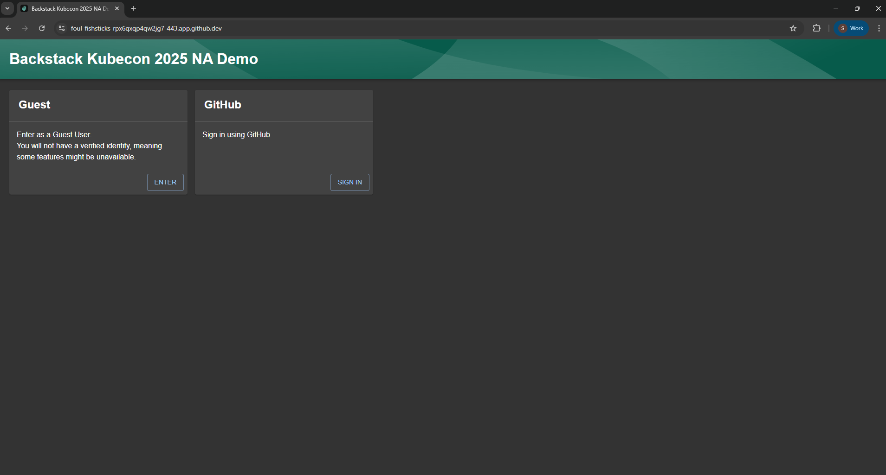

For this demo, we'll use **GitHub** login. In a production environment, you can use GitHub Auth or your organization's SSO provider like Okta, EntraID etc.

### Step 2: Exploring the Catalog

After logging in, you're presented with the **Software Catalog** - the central hub showing all components, systems, APIs, and resources in your organization.

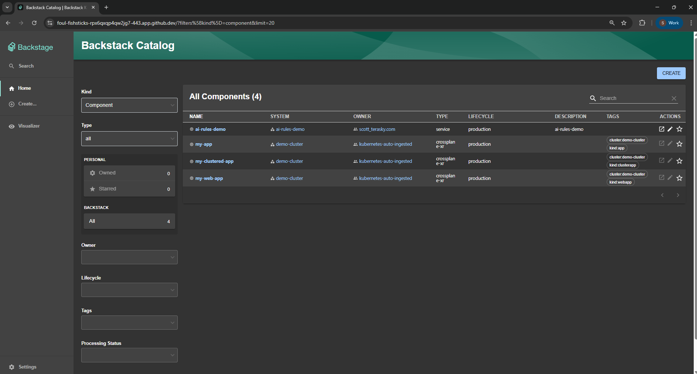

The catalog displays:
- **Components**: Applications and services
- **Systems**: Groupings of related components
- **Resources**: Infrastructure resources (databases, message queues, etc.)
- **APIs**: Service interfaces
- **Templates**: Software templates for creating new projects

You can filter by type, owner, tags, and other metadata to quickly find what you're looking for.

### Step 3: Viewing an Existing Application

Let's click on an existing application to see its details. Select **my-app** from the catalog.

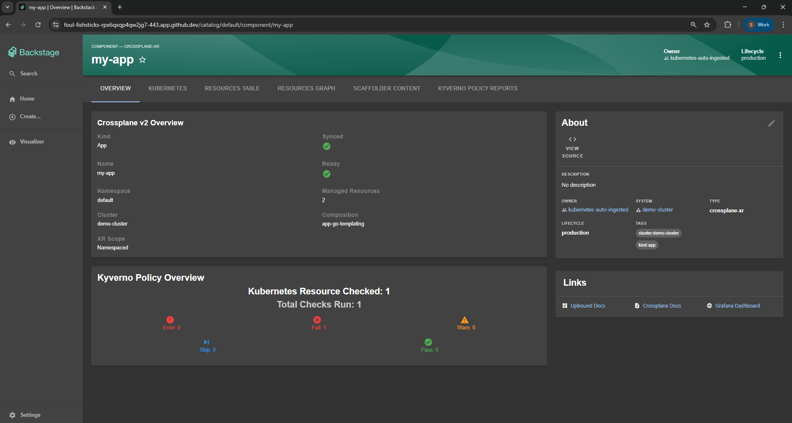

The application overview page shows:
- **About**: Description, owner, system, and metadata
- **Links**: Quick access to related resources
- **Relations**: Dependencies and relationships to other entities
- **Tags**: Categorization and searchability

#### Identifying Policy Violations

Notice the warning indicator on the page - this app has Kyverno policy violations. You can see a quick glance at the error:


#### Viewing Policy Details

Click on the **Kyverno** tab to see detailed policy reports:

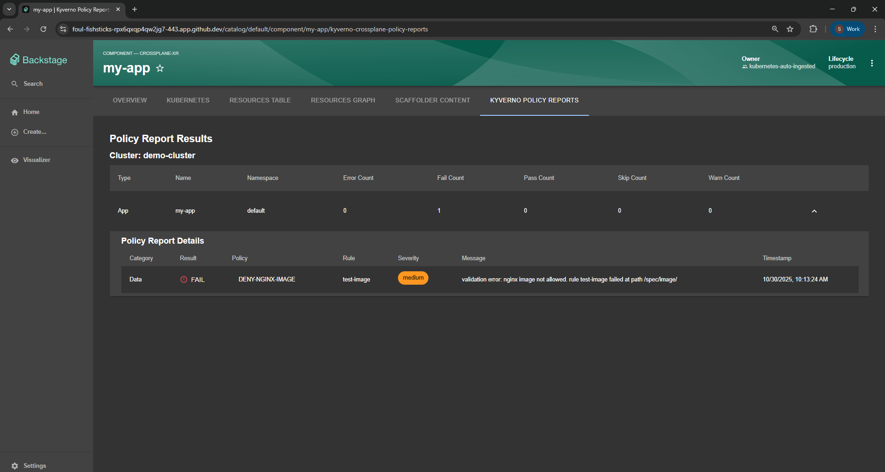

The Kyverno tab shows:
- **Policy name**: Which policy was violated
- **Severity**: High, Medium, or Low
- **Status**: Pass or Fail
- **Message**: Why the policy failed

For more details, click on the policy to open the **Policy Viewer**:


This shows:
- The complete policy definition
- Specific rules that failed
- Remediation guidance

In this case, the policy `deny-nginx-image` is failing because the app is using the `nginx` image, which is not allowed in this environment.

#### Viewing Crossplane Resources

Switch to the **Crossplane** tab to see the infrastructure resources provisioned for this application:

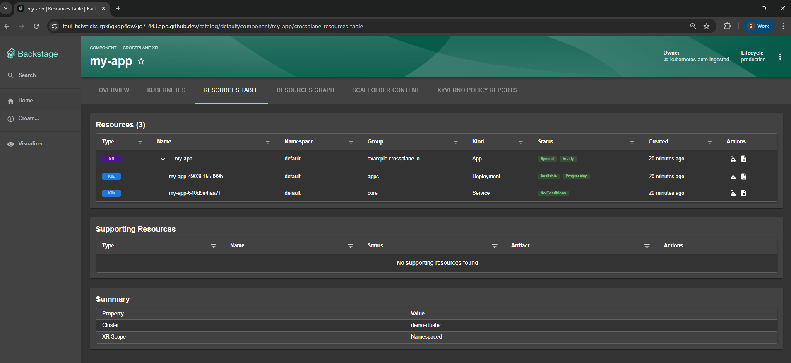

This view shows:
- **Claim Status**: Whether the Crossplane claim is ready
- **Managed Resources**: All Kubernetes resources created by Crossplane
- **Sync Status**: Whether resources are in sync with the desired state

You can click on any resource to see its YAML definition:

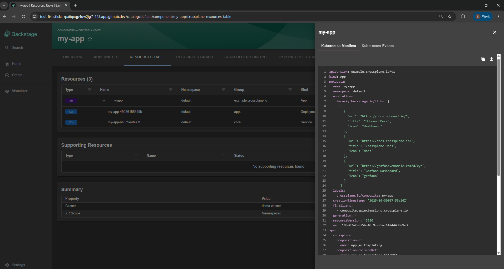

Or view its events to troubleshoot issues:

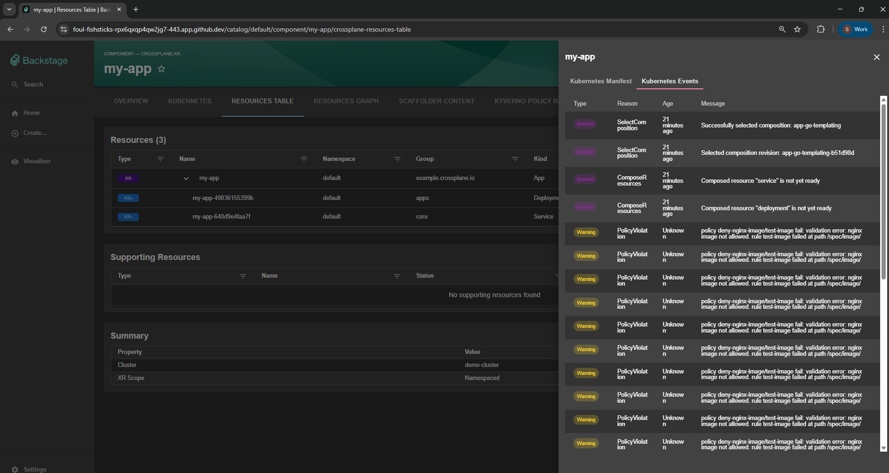

The **Graph View** provides a visual representation of resource relationships:

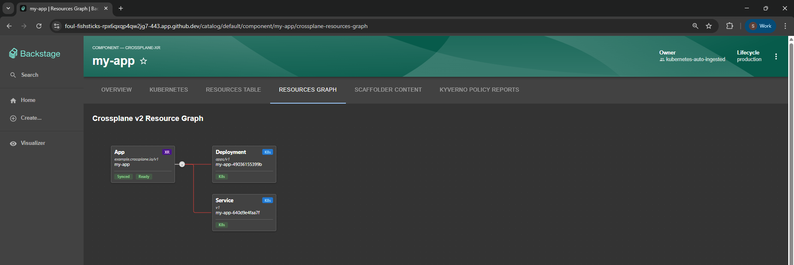

This helps you understand how your high-level claim translates into actual Kubernetes resources (Deployments, Services, etc.).

### Step 4: Creating a New Application

Now let's create a new application using the Software Templates feature. Click on **Create** in the sidebar.

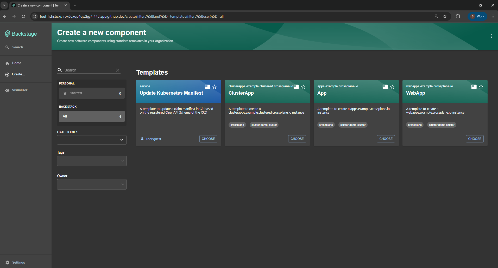

You'll see all available templates. These templates are generated automatically from Crossplane XRDs, ensuring that developers can automatically create resources that the platform supports.

#### Choosing a Template

Select the **App** template to create a new basic application.

#### Step 4.1: Application Metadata

First, provide basic metadata about your application:

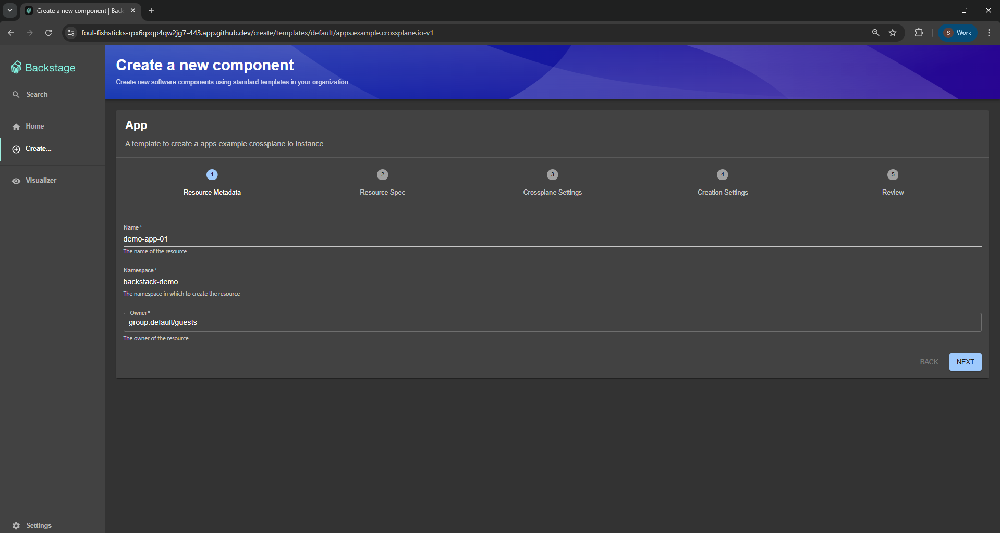

Fields typically include:
- **Name**: Application name (must be Kubernetes-compatible)
- **Namespace**: Where to deploy the app
- **Owner**: Which team owns it

In this demo we will call the component **demo-app-01** and put it in the namespace **backstack-demo**.

#### Step 4.2: Application Specification

Next, configure the application-specific settings:

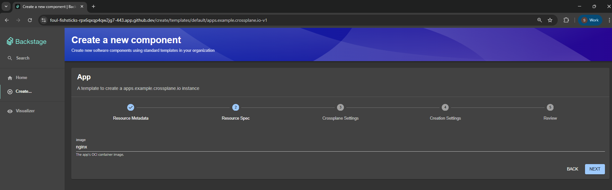

For a basic App, you'll specify:
- **Image**: Container image to deploy (e.g., `nginx`)
- Other app-specific parameters defined in the XRD

In this demo we will use the image **nginx**


#### Step 4.3: Crossplane Settings

Configure Crossplane-specific options:

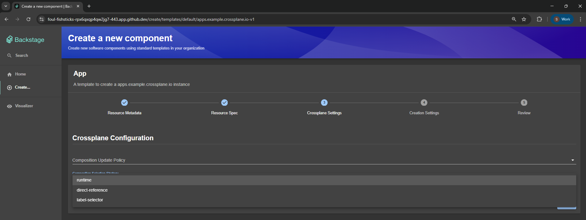

This includes:
- **Composition Selection**: Which implementation to use

You can choose from available compositions:

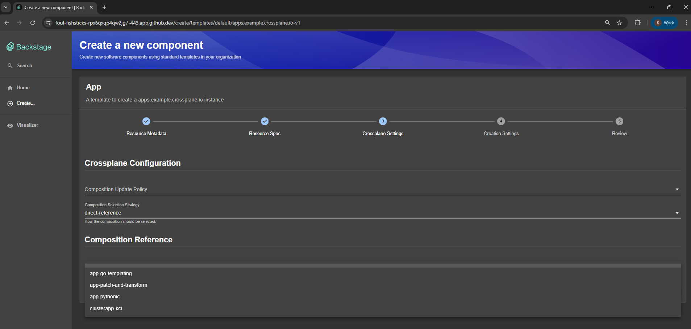

Different compositions might offer:
- Different cloud providers (AWS, GCP, Azure)
- Different performance tiers (basic, standard, premium)
- Different architectural patterns (serverless, containerized, etc.)

In this demo we will use **app-pythonic** as the composition.


#### Step 4.4: GitOps Settings

Configure where and how to store the application manifest:

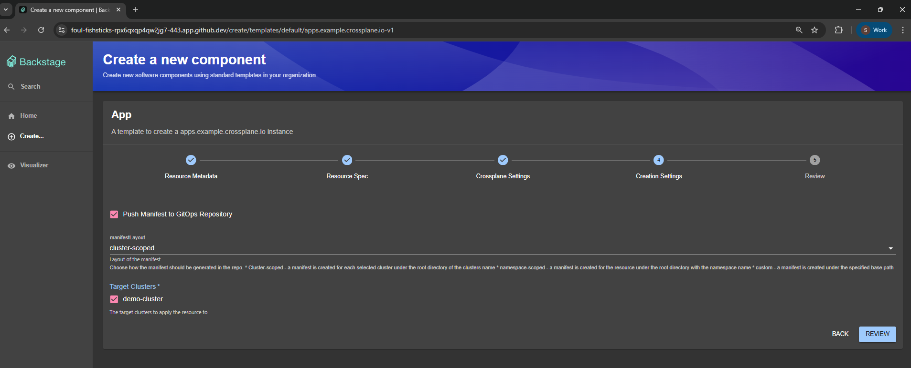

Settings include:
- **Push Manifest To GitOps Repository** - Enabled by default
- **Manifest Layout** - The strategy by which to place the manifest in the GitOps Repo
- **Target Clusters** - Which Clusters known to backstage we want to deploy or manifest to

In this demo we will use the **cluster-scoped** manifest layout and as we only have 1 cluster attached to backstage, we will select **demo-cluster**.

#### Step 4.5: Review Your Choices

Before creating the application, review all your selections:

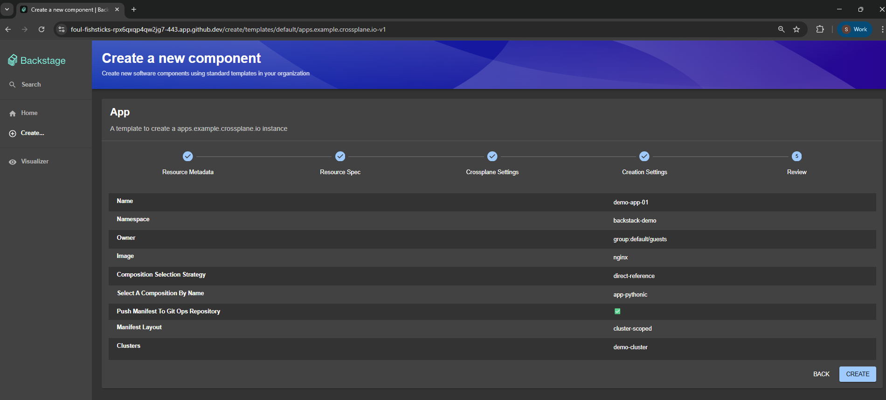

This gives you a chance to:
- Verify all parameters are correct
- Go back to edit any section
- Understand what will be created

#### Step 4.6: Execution Summary

Click **Create** to execute the template. You'll see a real-time execution log:


The scaffolder will:
1. ✅ Generate the Crossplane claim YAML
2. ✅ Create a Git branch
3. ✅ Commit the manifest to the repository
4. ✅ Create a Pull Request

### Step 5: GitOps Workflow

After the scaffolder completes, a Pull Request is automatically created in your repository.

#### Viewing the Pull Request

Navigate to GitHub to review the PR:

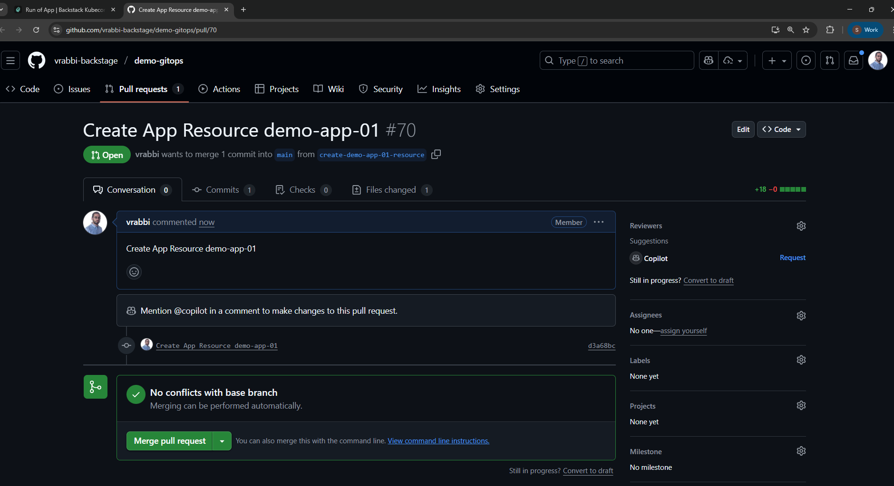

The PR includes:
- **Title**: Descriptive name of the change
- **Description**: Details about what's being added
- **Labels**: Automated tags for classification
- **Checks**: CI/CD validations (linting, security scans, etc.)

#### Reviewing Changed Files

Click on **Files Changed** to see what will be added:

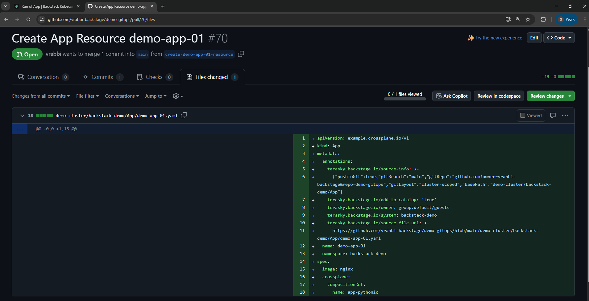

This shows:
- The exact YAML manifest that will be deployed
- The directory structure (following ArgoCD ApplicationSet pattern)

Example structure:
```
demo-cluster/
  └── default/
      └── App/
          └── my-new-app.yaml
```

#### Merging the Pull Request

After review and approval (if required), merge the PR:

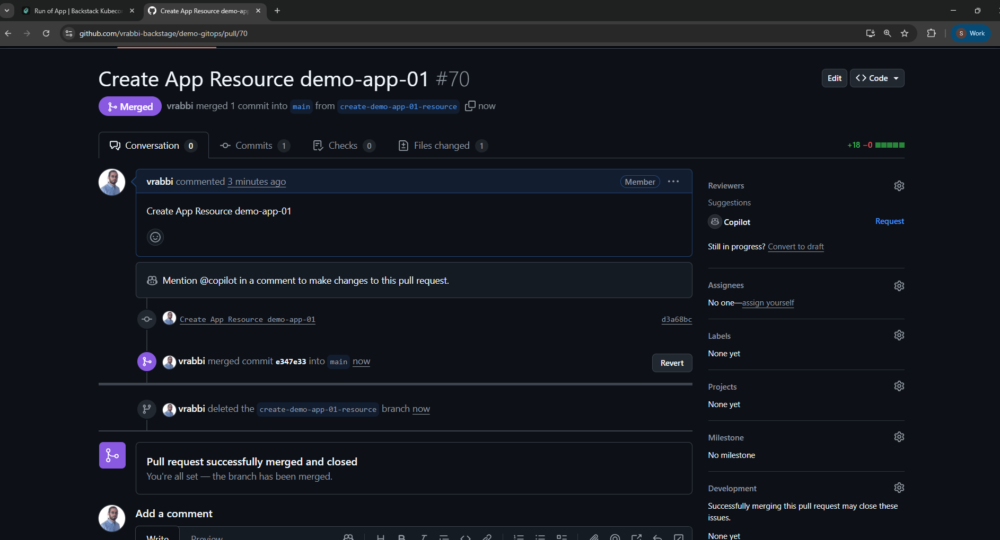

### Step 6: Automated Resource Creation

Once the PR is merged, the GitOps workflow automatically kicks in:

#### ArgoCD Detects the Change

ArgoCD's ApplicationSet detects the new file and creates an Application:

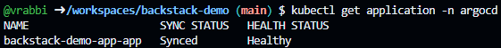

You can verify this with:
```bash
kubectl get applications -n argocd
```

#### Crossplane Provisions Resources

The Crossplane composite is applied to the cluster, and Crossplane begins provisioning resources:

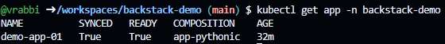

You can check the composite status with:
```bash
kubectl get apps -n backstack-demo
```

#### Backstage Discovers the Application

The Kubernetes Ingestor plugin automatically discovers the new Crossplane composite and creates a Backstage catalog entity:

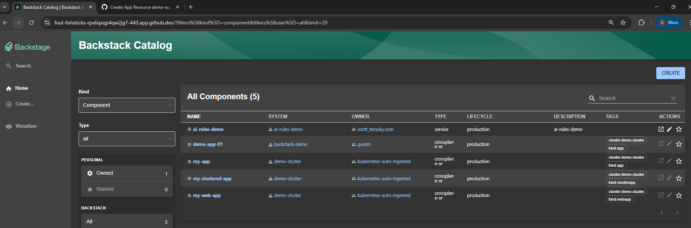

Within seconds (configured as 10-second polling), your new application appears in the Backstage catalog with:
- Full metadata from the Crossplane composite
- Annotations and labels
- Relationships to other resources
- Integration with Kyverno and Crossplane plugins


#### ArgoCD Visibility

Now if we click on our new component in the catalog, we will see on the overview page a new widget from the ArgoCD plugin, as well as a new tab for the component page around ArgoCD Deployment Lifecycle.

The widget gives us a high level view of the ArgoCD applications status, as well as a hyperlink to the ArgoCD UI directly to the component allowing for a simple UX for developers.
  
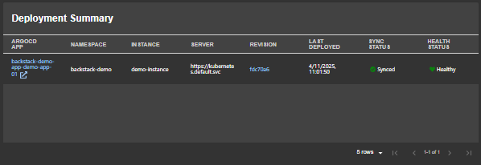
  
The Tab gives us a more detailed view including links to the ArgoCD UI, as well as links to the specific git commit currently being targetted by this application.
  
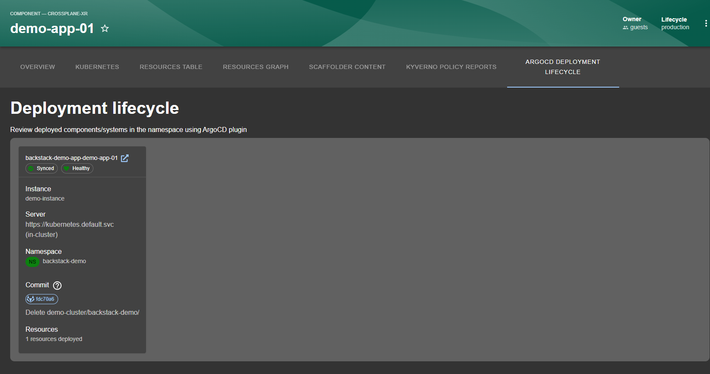
  
If you want to login to the ArgoCD UI, you can use the user admin. The password can be retrieved running the bellow commands:

```bash
export ARGOCD_ADMIN_PASSWORD=`kubectl get secret -n argocd argocd-initial-admin-secret -o jsonpath='{.data.password}' | base64 --decode`

echo "ArgoCD URL: https://${CODESPACE_NAME}-443.${GITHUB_CODESPACES_PORT_FORWARDING_DOMAIN}/argocd"
echo "ArgoCD Username: admin"
echo "ArgoCD Password: ${ARGOCD_ADMIN_PASSWORD}"
```

### Step 7: Addressing Policy Violations

When you view the newly created app in Backstage, you might see policy violations:

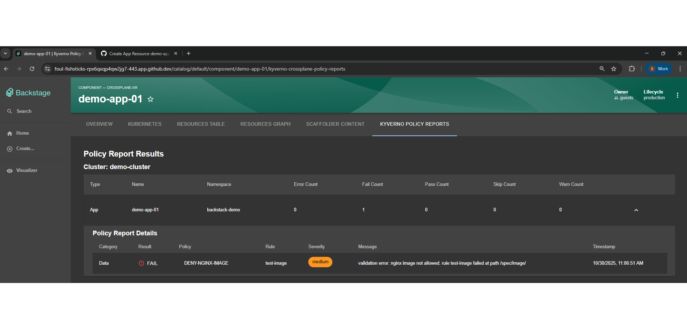

In this example:
- ❌ **deny-nginx-image**: The app is using the nginx image (not allowed)
- ❌ **require-autoscaling** (if it's a WebApp): Autoscaling is not enabled

Let's fix these violations using the **GitOps Manifest Updater** plugin.

### Step 8: Updating the Application Manifest

In this environment we have added a backstage plugin which provides a **GitOps Manifest Updater** feature that lets you modify manifests without manually editing YAML files.

#### Access the Entity Scaffolder

Go to the **Scaffolder Content** tab on the entity page:

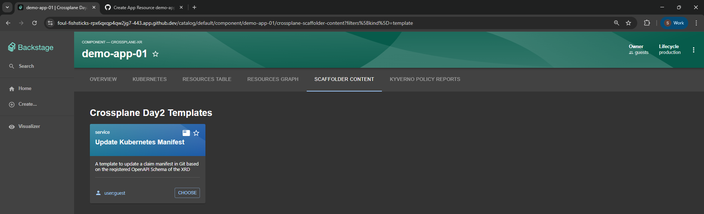

This shows templates that are contextual to the current entity. Click on the **Update Kubernetes Manifest** template.

#### Select the Entity to Update

If prompted, confirm which entity you want to update:

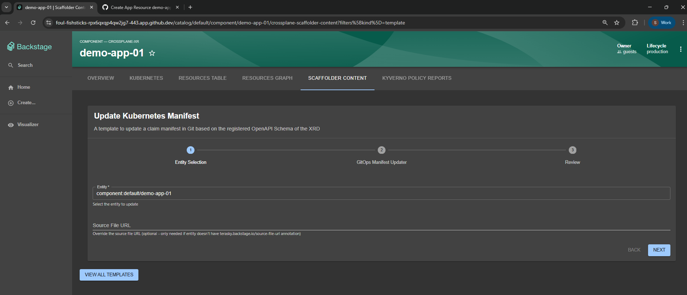

#### Authenticate with GitHub

You'll need to authenticate with GitHub to update the manifest:

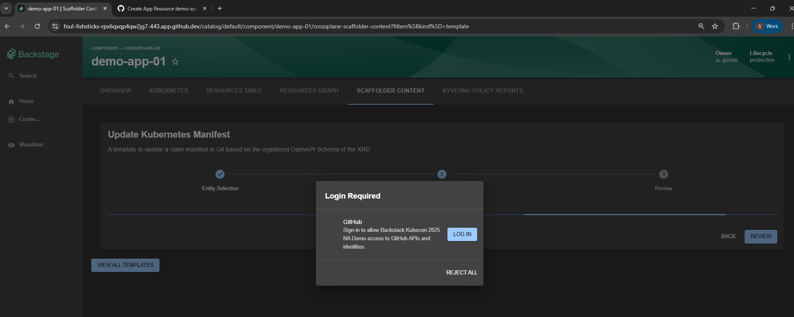

This uses OAuth to grant Backstage temporary access to your repositories.

#### Fill Out the Update Form

The GitOps Manifest Updater dynamically generates a form based on the Crossplane XRD's OpenAPI schema, and the current state stored in your GitOps repository:

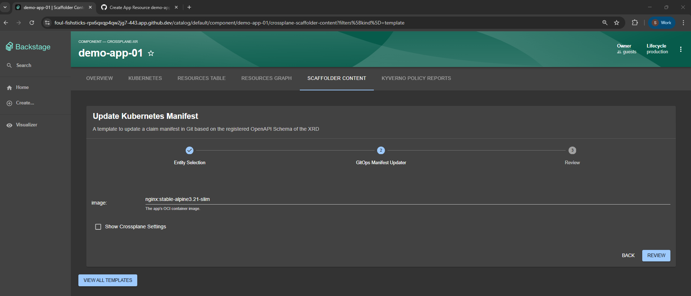

You can for example:
- Change the container image from `nginx` to a compliant image

The form includes:
- **Type validation**: Ensures values match the schema
- **Required field indicators**: Shows what must be filled
- **Default values**: Pre-populated with current settings
- **Descriptions**: Help text from the XRD schema

In this demo we will change the image to **nginx:stable-alpine3.21-slim**


#### Review Your Changes

Before submitting, review what will be changed:

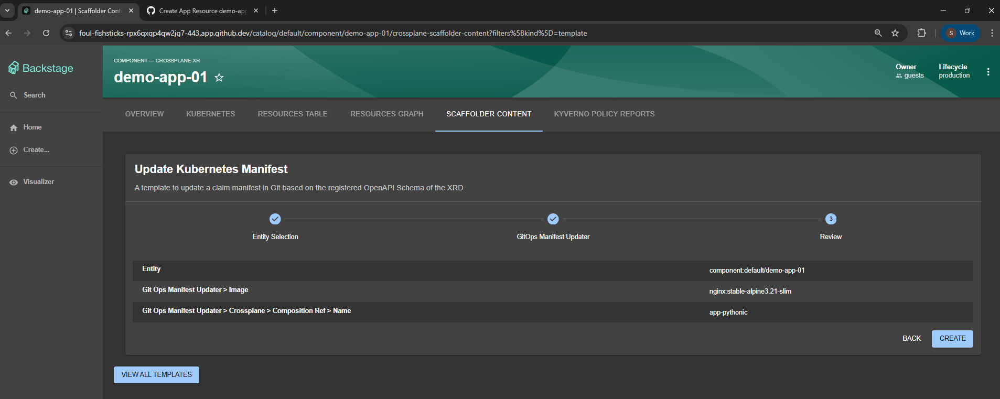

This shows:
- A diff of the changes
- Which fields are being modified

#### Execution Summary

Submit the update to create a PR:

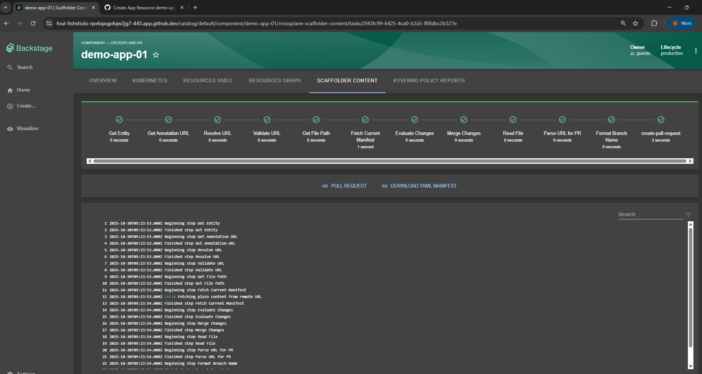

The workflow:
1. ✅ Clones the repository
2. ✅ Creates a new branch
3. ✅ Updates the manifest YAML
4. ✅ Commits the changes
5. ✅ Creates a Pull Request

### Step 9: Merging the Update

Navigate to GitHub to review the update PR:

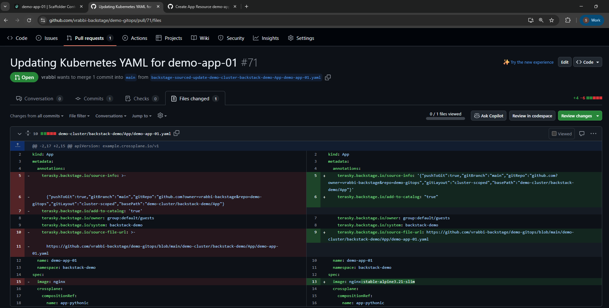

After review, merge the PR. ArgoCD will detect the change and sync it to the cluster.

#### Manual Sync (Optional)

If you don't want to wait for the automatic sync interval, you can manually trigger a sync:

```bash
kubectl patch application backstack-demo-app-demo-app-01 -n argocd \
  --type merge \
  -p '{"operation":{"initiatedBy":{"username":"admin"},"sync":{"syncStrategy":{"hook":{"force":true}}}}}'
```

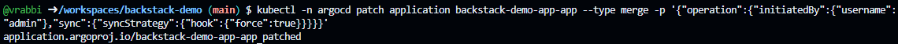

This can also be done via the ArgoCD CLI or UI.

### Step 10: Verifying Policy Compliance

After ArgoCD syncs the updated manifest, Crossplane updates the running application. Kyverno automatically re-evaluates the policies.

Return to Backstage and refresh the entity page:

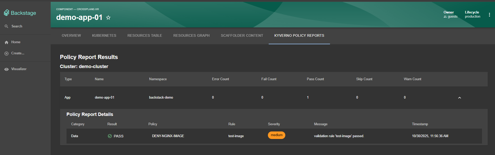

✅ **Success!** The policy violations are resolved:
- ✅ **deny-nginx-image**: Now using a non blocked image

The entity page now shows:
- All policies passing (green indicators)
- No warnings or errors
- Full compliance with organizational standards

### Summary: Developer Experience

This end-to-end flow demonstrates the complete developer experience in the BACKStack platform:

#### 🔍 **Discovery**
- Browse the software catalog to find existing applications
- Understand relationships between components, systems, and APIs
- View documentation and links to related resources

#### 🚀 **Creation**
- Use auto-generated templates based on platform capabilities
- Fill out forms instead of writing YAML
- Leverage GitOps workflows for all changes
- Automatic PR creation and reviews

#### 📊 **Observability**
- View Crossplane resource status and health
- See Kyverno policy compliance at a glance
- Access detailed resource information (YAML, events, logs)
- Visualize resource relationships with graph views

#### 🔧 **Remediation**
- Identify policy violations immediately
- Use dynamic forms to update manifests
- GitOps-based updates with full audit trail
- Automatic re-validation after changes

#### 🎯 **Benefits**
- **Self-Service**: Developers can provision infrastructure without platform team involvement
- **Safety**: Policies ensure compliance and best practices
- **Visibility**: Full transparency into resource status and health
- **Efficiency**: Automated workflows reduce manual toil
- **Consistency**: Templates ensure standardized deployments
- **Auditability**: All changes tracked through Git and PRs

This workflow exemplifies the **Platform Engineering** philosophy: providing developers with powerful, easy-to-use abstractions while maintaining organizational standards and operational best practices.
</details>


<details>
<summary>End to End Flow - Platform Engineer</summary>

## End to end flow - Platform Engineer Perspective
Now lets look at the Platform Engineers experience working on a platform based on the BACKStack.

The scenario we will be implementing in this workshop is:
1. Adding a new service offering to our end users
2. Updating a service offering already being used
3. Letting users know they need to make some changes and guiding them through the platform

### New Service Offering Workflow
In this demo we are going to create a new Crossplane XRD and Composition to support creating PostgreSQL clusters in our environments using the Cloud Native PostgreSQL operator

#### Deploying the CNPG Operator
The first step we must take is to install the operator

```bash
helm repo add cnpg https://cloudnative-pg.github.io/charts
helm upgrade --install cnpg \
  --namespace cnpg-system \
  --create-namespace \
  cnpg/cloudnative-pg \
  --wait
```

#### Defining Our New Service
Now that we have our operator installed we can create an XRD for our new service offering

```bash
mkdir crossplane/04-xrds/dbaas
touch crossplane/04-xrds/dbaas/xrd.yaml
```

We can now start by adding the initial Metadata and general configurations to the [new file](../../crossplane/04-xrds/dbaas/xrd.yaml)

```yaml
apiVersion: apiextensions.crossplane.io/v2
kind: CompositeResourceDefinition
metadata:
  name: databases.demo.kubecon2025na.io
spec:
  scope: Namespaced
  group: demo.kubecon2025na.io
  names:
    kind: Database
    plural: databases
```

As we can see we are defining a new **namespace scoped** XRD with the kind **Database** in the **demo.kubecon2025na.io** API Group.

Now we need to add the schema of our API we want our users to use

```yaml
  versions:
  - name: v1
    served: true
    referenceable: true
    schema:
     openAPIV3Schema:
        properties:
          spec:
            description: The OpenAPIV3Schema of this Composite Resource Definition.
            properties:
              storageGB:
                default: 1
                description: The desired storage capacity of the database, in Gigabytes.
                enum:
                - 1
                - 2
                - 5
                type: integer
              version:
                default: 17.1
                description: The desired version of the database.
                enum:
                - 17.1
                - 17.2
                type: number
              highAvailability:
                default: false
                description: Enable high availability.
                type: boolean
            type: object
        type: object
```

This API allows our users to only change specific elements of the cluster configuration that we have decided to allow them to configure:
- **Disk Size**
- **PostgreSQL Version**
- **High Availability**

Now let's implement the Composition:

```bash
mkdir crossplane/05-compositions/dbaas
touch crossplane/05-compositions/dbaas/cnpg-go-templating.yaml
```

We will first add the basic information in our [new file](../../crossplane/05-compositions/dbaas/cnpg-go-templating.yaml)
  
```yaml
apiVersion: apiextensions.crossplane.io/v1
kind: Composition
metadata:
  name: cnpg-demo
spec:
  compositeTypeRef:
    apiVersion: demo.kubecon2025na.io/v1
    kind: Database
  mode: Pipeline
```

Here we have defined that this composition will be called **cnpg-demo** and will be an implementation for the XRD we defined above. 

The next step is to implement the Composition pipeline logic. In this example we will use the **go-templating** function.

```yaml
  pipeline:
  - step: create-db
    functionRef:
      name: crossplane-contrib-function-go-templating
    input:
      apiVersion: gotemplating.fn.crossplane.io/v1beta1
      kind: GoTemplate
      source: Inline
      inline:
        template: |
          ---
          apiVersion: postgresql.cnpg.io/v1
          kind: Cluster
          metadata:
            name: {{ index .observed.composite.resource.metadata.name }}
            annotations:
              {{ setResourceNameAnnotation "database" }}
              {{ if eq (.observed.resources.database | getResourceCondition "Ready").Status "True" }}
              gotemplating.fn.crossplane.io/ready: "True"
              {{ end }}
          spec:
            {{- if .observed.composite.resource.spec.highAvailability }}
            instances: 3
            {{- else }}
            instances: 1
            {{- end }}
            imageName: ghcr.io/cloudnative-pg/postgresql:{{ .observed.composite.resource.spec.version }}
            storage:
              size: {{ .observed.composite.resource.spec.storageGB }}Gi
```

Now that we have our base XRD and Compositions created we need to apply them to the cluster:

```bash
kubectl apply -f crossplane/04-xrds/dbaas/xrd.yaml
kubectl apply -f crossplane/05-compositions/dbaas/cnpg-go-templating.yaml
```

One final thing we need to do, because we are not using a crossplane provider resource rather a CNPG Operator based resource, we need to give Crossplane permissions to manage these resources for us:

```bash
cat <<EOF | kubectl apply -f-
apiVersion: rbac.authorization.k8s.io/v1
kind: ClusterRole
metadata:
  name: cnpg:aggregate-to-crossplane
  labels:
    rbac.crossplane.io/aggregate-to-crossplane: "true"
rules:
- apiGroups:
  - postgresql.cnpg.io
  resources:
  - clusters
  verbs:
  - "*"
EOF
```

Now we can go to Backstage and we should see within a few seconds, the new Template available in our platform!

#### Creating A DB instance
Lets now look at this for a moment from the developers perspective of consuming the service.

We first will navigate to Backstage and click on **Create** in the sidebar, and then select the Database template.

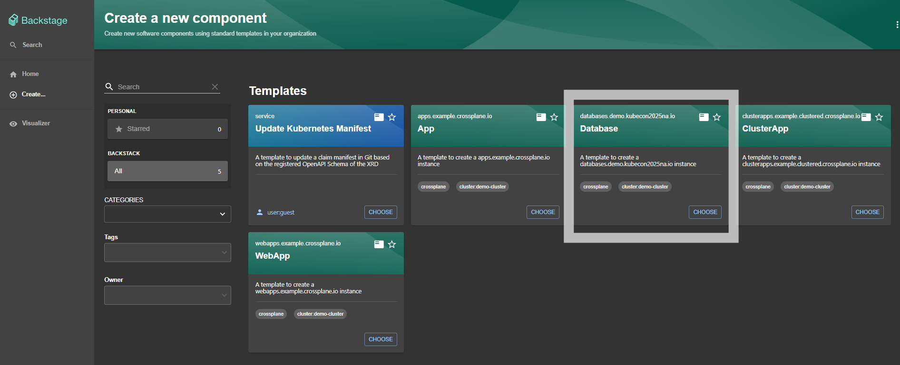


##### Database Metadata

First, provide basic metadata about your application:

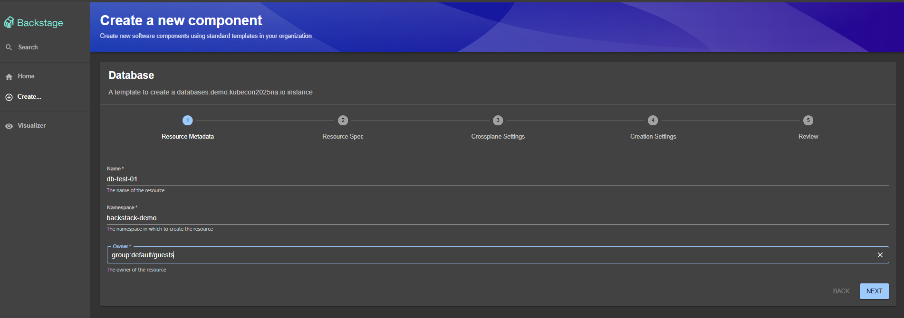

Fields typically include:
- **Name**: Database name (must be Kubernetes-compatible)
- **Namespace**: Where to deploy the app
- **Owner**: Which team owns it

In this demo we will call the component **db-test-01** and put it in the namespace **backstack-demo**.

##### Database Spec

Next, configure the database-specific settings:

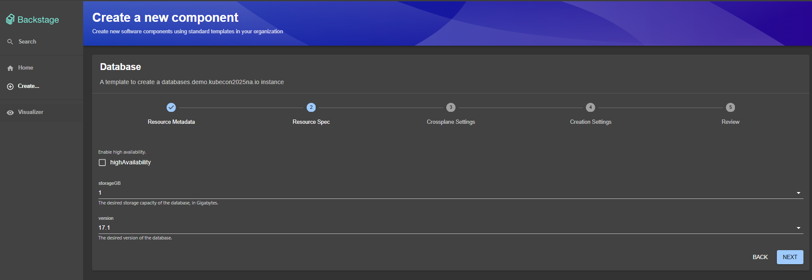

As we can see, the fields we have defined in our XRD including field types, enums, etc. are exposed here via the form.

In this demo we will use the storage size of **1**, we will **not** enable high availability, and we will choose **17.1** as the PostgreSQL version.


##### Crossplane Settings

Configure Crossplane-specific options:

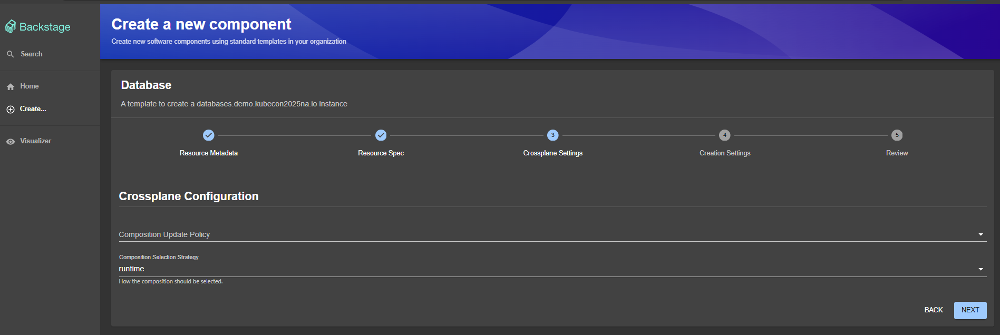

##### GitOps Settings

Configure where and how to store the DB manifest:

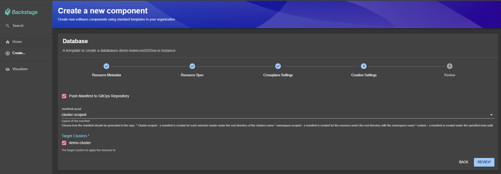

Settings include:
- **Push Manifest To GitOps Repository** - Enabled by default
- **Manifest Layout** - The strategy by which to place the manifest in the GitOps Repo
- **Target Clusters** - Which Clusters known to backstage we want to deploy or manifest to

In this demo we will use the **cluster-scoped** manifest layout and as we only have 1 cluster attached to backstage, we will select **demo-cluster**.

##### Review Your Choices

Before creating the db, review all your selections:

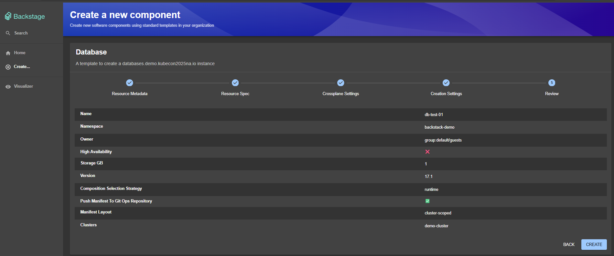

This gives you a chance to:
- Verify all parameters are correct
- Go back to edit any section
- Understand what will be created

##### Execution Summary

Click **Create** to execute the template. You'll see a real-time execution log:

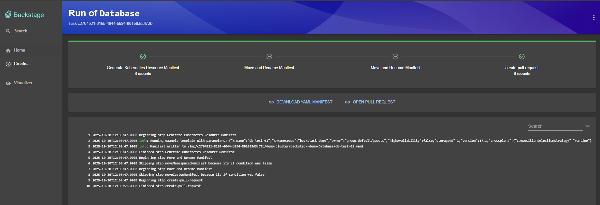

The scaffolder will:
1. ✅ Generate the Crossplane composite YAML
2. ✅ Create a Git branch
3. ✅ Commit the manifest to the repository
4. ✅ Create a Pull Request

##### GitOps Workflow

After the scaffolder completes, a Pull Request is automatically created in your repository.

##### Viewing the Pull Request

Navigate to GitHub to review the PR.

The PR includes:
- **Title**: Descriptive name of the change
- **Description**: Details about what's being added
- **Labels**: Automated tags for classification
- **Checks**: CI/CD validations (linting, security scans, etc.)

##### Reviewing Changed Files

Click on **Files Changed** to see what will be added:

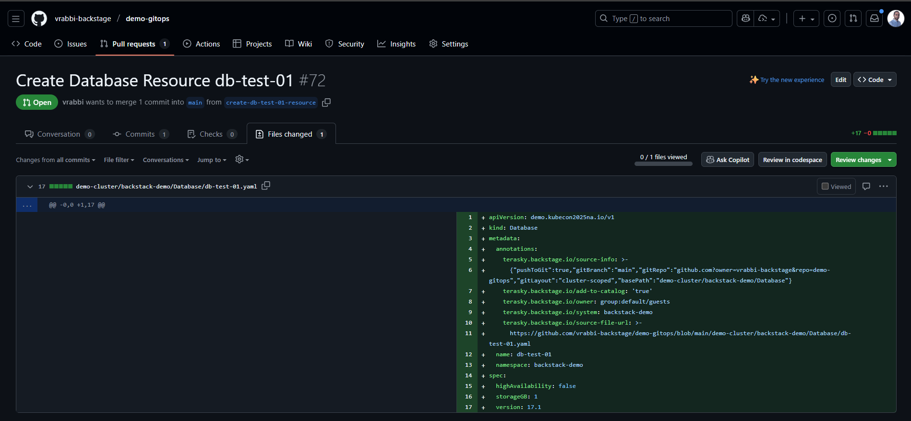

This shows:
- The exact YAML manifest that will be deployed
- The directory structure (following ArgoCD ApplicationSet pattern)

Example structure:
```
demo-cluster/
  └── default/
      └── Database/
          └── my-db.yaml
```

##### Merging the Pull Request

After review and approval (if required), merge the PR.

#### Automated Resource Creation
Once the PR is merged, the GitOps workflow automatically kicks in:

##### ArgoCD Detects the Change

ArgoCD's ApplicationSet detects the new file and creates an Application:

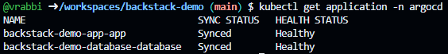

You can verify this with:
```bash
kubectl get applications -n argocd
```

#### Crossplane Provisions Resources

The Crossplane composite is applied to the cluster, and Crossplane begins provisioning resources:

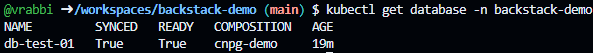

You can check the composite status with:
```bash
kubectl get database -n backstack-demo
```

#### Backstage Discovers the Application

The Kubernetes Ingestor plugin automatically discovers the new Crossplane composite and creates a Backstage catalog entity:

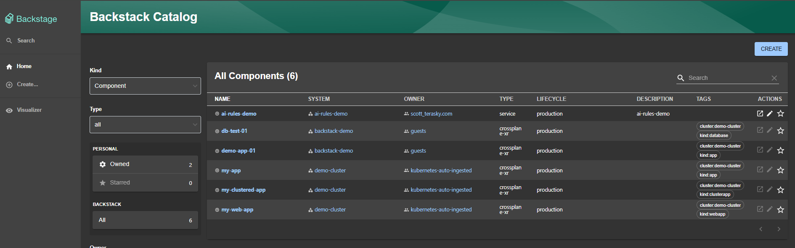

Within seconds (configured as 10-second polling), your new DB appears in the Backstage catalog with:
- Full metadata from the Crossplane composite
- Annotations and labels
- Relationships to other resources
- Integration with Kyverno and Crossplane plugins


### Updating A Service Offering Workflow
Now that we have out Database offering in the platform and it is being consumed by our platform users, we need to handle Day-2 changes.

We have already seen in the Developer workflow how we can allow users to update an existing resource. but lets now see how we can evolve our APIs over time.

In this example we will be adding a new version for PostgreSQL, and we also want to deprecate the older versions.

#### Updating the supported versions
We can open the [XRD manifest](../../crossplane/04-xrds/dbaas/xrd.yaml) and change the enum values to include our new supported versions and also change the default version

In this example we will change the default version to **17.4** and also add **17.4** to the enum values
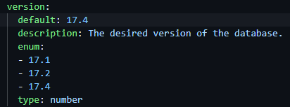

With the changes made in the manifest we can now apply this to our cluster
```bash
kubectl apply -f crossplane/04-xrds/dbaas/xrd.yaml
```

Now that the change has been applied to the cluster, we can go back to the Create tab in Backstage, and when we try to create a new Database instance, we can see that 17.3 is an option.
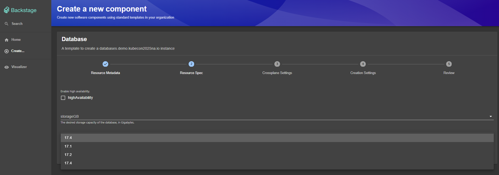

#### Deprecating Old Versions
One of the common cases which is relevant for our demo, is deprecation of old DB versions, and needing users to upgrade to later versions.

Let's see how we can implement this in a simple and elegant manner using the BACKStack ecosystem.

For this we will utilize a Kyverno policy which we can create, which can be used to provide feedback to our end users.

Let's start by creating a new file for our policy:
```bash
touch kyverno/deprecate-old-psql-versions.yaml
```
Now we can start to implement the policy itself:

```yaml
apiVersion: kyverno.io/v1
kind: ClusterPolicy
metadata:
  annotations:
    policies.kyverno.io/category: Data
    policies.kyverno.io/severity: medium
    policies.kyverno.io/scored: "false"
  name: postgres-deprecations
spec:
  admission: true
  background: true
  validationFailureAction: Audit
```

Now that we have built the base of the policy, we need to add our relevant rules to deprecate the older versions which in this case are **17.1** and **17.2**.

Let's add these rules:
```yaml
  rules:
  - name: psql-17-1-deprecation
    match:
      any:
      - resources:
          kinds:
          - Database
    skipBackgroundRequests: true
    validate:
      message: version 17.1 is deprecated and will be removed on JAnuary 1st, 2026
      deny:
        conditions:
          all:
            - key: "{{ request.object.spec.version }}"
              operator: Equals
              value: 17.1
  - name: psql-17-2-deprecation
    match:
      any:
      - resources:
          kinds:
          - Database
    skipBackgroundRequests: true
    validate:
      message: version 17.2 is deprecated and will be removed on May 1st, 2026
      deny:
        conditions:
          all:
            - key: "{{ request.object.spec.version }}"
              operator: LessThanOrEquals
              value: 17.2
```

Now that we have our policy defined let's apply it to our cluster:

```bash
kubectl apply -f kyverno/deprecate-old-psql-versions.yaml
```

With this policy now applied to our cluster, we can go back to the Backstage UI and go to the software catalog and find our old Database instance to see what the UX from the Users perspective will be:

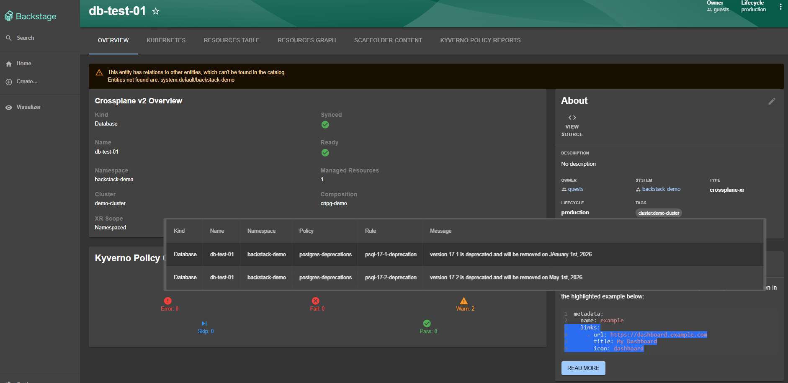

Now the user can see exactly what the issue is, and he can now when ready apply the update using the Scaffolder Content Tab:

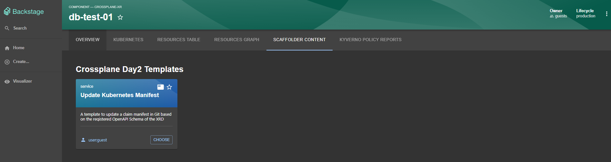

We can now select the **Update Kubernetes Manifest** Template:


And with our entity pre-selected, we can now see the current state in the form:

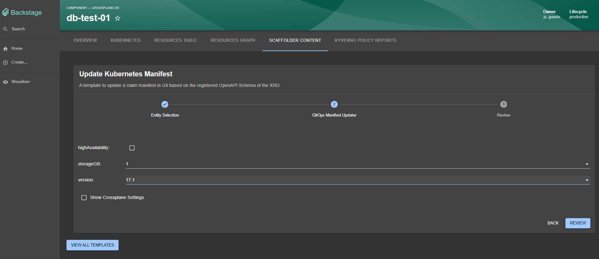

And we can see that the new version is available in the dropdown and can be selected:

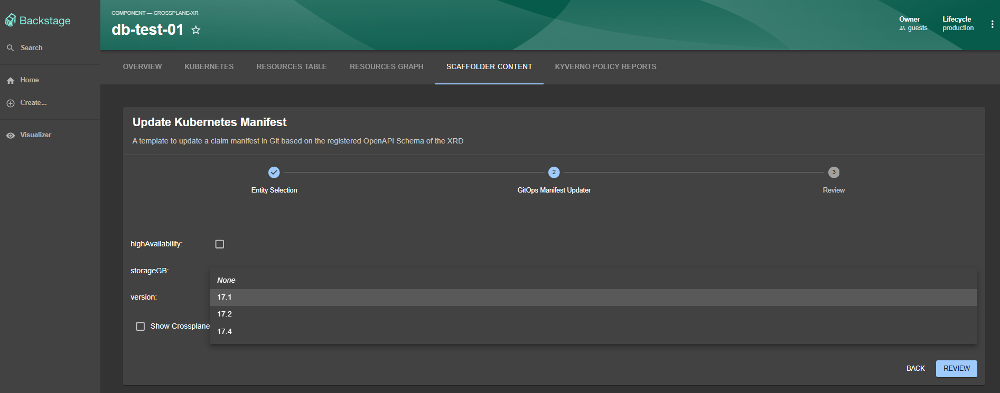

Once we select the new version, we can review the changes:


And then when we are happy with the changes, we can run the template by clicking Create:

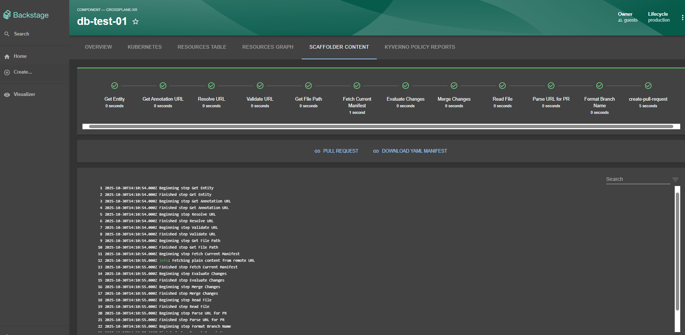

We can then navigate to the GitOps repo, and we can approve the PR after checking the changed files:

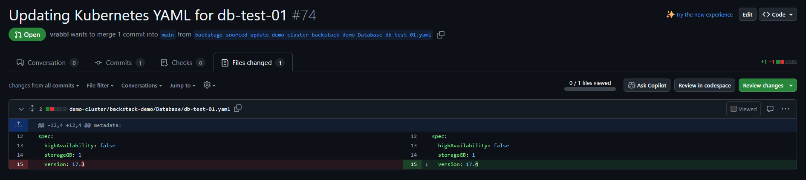

And finally to save time and not wait for reconciliation of ArgoCD we can manually trigger the sync of the application managing this Database resource

```bash
kubectl patch application backstack-demo-database-db-test-01 -n argocd \
  --type merge \
  -p '{"operation":{"initiatedBy":{"username":"admin"},"sync":{"syncStrategy":{"hook":{"force":true}}}}}'
```

We can see that from the Kubernetes side the Database resource gets updated right away within a few seconds:

```bash
kubectl get database -n backstack-demo db-test-01 -o jsonpath='{.spec.version}'
```

And if we go back to the UI now in Backstage we can see that the Resource is updated in the UI and after about a minute the policy reevaluates, and the results now show 2 passing rules:

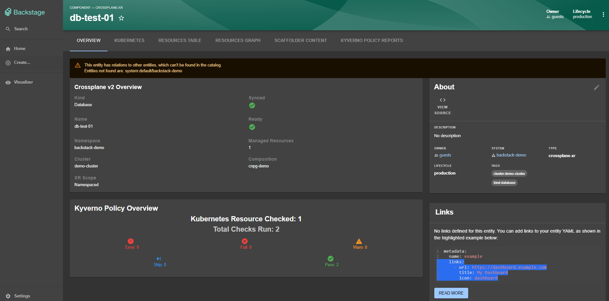

### Summary: Platform Engineer Experience

This end-to-end flow demonstrates the platform engineer experience in the BACKStack platform, showing how to extend and evolve the platform over time:

#### 🏗️ **New Service Offerings**
- **Operator Installation**: Deploy required infrastructure operators (CNPG)
- **XRD Definition**: Create high-level APIs for platform capabilities
- **Composition Implementation**: Define how abstractions map to concrete resources
- **RBAC Configuration**: Grant necessary permissions for Crossplane to manage resources
- **Automatic Discovery**: New templates appear in Backstage within seconds

**Key Benefits:**
- Declarative API design with OpenAPI schemas
- Automatic form generation from XRD specifications
- Validation and enums enforce constraints at the API level
- No manual template creation required

#### 🔄 **Service Evolution**
- **Version Updates**: Add new supported versions to XRD enums
- **Default Changes**: Update default values as platform matures
- **Backward Compatibility**: Existing resources continue working
- **Immediate Availability**: Changes reflected in Backstage forms instantly

**Platform Capabilities:**
- Schema evolution without breaking existing consumers
- Type-safe updates through OpenAPI validation
- Centralized version management in XRD definitions
- GitOps-tracked infrastructure changes

#### 📢 **User Communication & Migration**
- **Policy-Based Notifications**: Use Kyverno policies to communicate deprecations and changes
- **Clear Messaging**: Policy messages explain what's changing and when
- **Guided Remediation**: Entity Scaffolder provides easy update path
- **Audit Mode**: Warn users without blocking existing workloads
- **Automatic Re-evaluation**: Policies check compliance after updates

**Communication Flow:**
1. Platform team updates XRD with new versions
2. Platform team creates Kyverno deprecation policy
3. Users see warnings in Backstage entity pages
4. Users can update via dynamic forms
5. Policy automatically clears after update

#### 🎯 **Platform Engineering Benefits**

##### **For Platform Engineers:**
- **Self-Service Enablement**: Users can consume services without ticket queues
- **Consistent Standards**: APIs enforce organizational best practices
- **Gradual Rollout**: Add features incrementally without big-bang migrations
- **Clear Contracts**: OpenAPI schemas document capabilities and constraints
- **Version Control**: All platform definitions tracked in Git
- **Automated Validation**: Policies prevent misconfigurations

##### **For End Users (Developers):**
- **Discoverability**: New services automatically appear in catalog
- **Easy Consumption**: Forms instead of YAML authoring
- **Clear Guidance**: Deprecation warnings with actionable steps
- **Safe Updates**: Preview changes before applying
- **Full History**: GitOps provides audit trail of all changes

##### **For the Organization:**
- **Faster Innovation**: New services rolled out in minutes, not weeks
- **Reduced Operational Burden**: Self-service reduces platform team load
- **Compliance**: Policies ensure adherence to standards
- **Agility**: Quick response to security updates and deprecations
- **Transparency**: Full visibility into platform capabilities and usage


#### 📊 **Metrics & Observability**

Platform engineers can track:
- **Time to Market**: How quickly new services are adopted
- **Self-Service Adoption**: Percentage of manual requests eliminated
- **Compliance Rate**: Policy adherence across the organization
- **Deprecation Progress**: Tracking migration to newer versions
- **Resource Utilization**: Understanding platform usage patterns

#### 🚀 **Platform Maturity Path**

The BACKStack approach supports platform maturity:

**Phase 1 - Foundation:**
- Deploy core stack (Backstage, Crossplane, ArgoCD, Kyverno)
- Create first simple abstractions (basic apps)
- Establish GitOps workflows

**Phase 2 - Expansion:**
- Add new service offerings (databases, message queues, caches)
- Introduce policies for governance
- Enable self-service for developers

**Phase 3 - Optimization:**
- Evolve APIs based on usage patterns
- Implement deprecation policies
- Add multi-cloud compositions

**Phase 4 - Scale:**
- Multi-team platform management
- Advanced policies and quotas
- Cost optimization and chargeback
</details>

# Bringing AI Into The Mix
<details>
<summary>AI in the BACKStack</summary>

## AI Plugins In Backstage
One of the ways to integrate AI into our environment is by adding plugins into our Backstage instance.

There are multiple options already available in the community for this:
- [**Agent Forge**](https://github.com/backstage/community-plugins/tree/main/workspaces/agent-forge/plugins/agent-forge) - A Backstage plugin which integrates with the CNOE project called CAIPE (Commnity AI Platform Engineering) to provide specialized chatbots with specified Agents for different elements in the stack directly into the Backstage UI.  


  
- [**MCP Chat**](https://github.com/backstage/community-plugins/tree/main/workspaces/mcp-chat/plugins/mcp-chat) - A Backstage set of plugins providing a powerful MCP based chatbot directly in the Backstage UI
  

  
- [**Copilot**](https://github.com/backstage/community-plugins/tree/main/workspaces/copilot/plugins/copilot) - A Backsytage set of plugins giving visibility and insights into GitHub Copilot usage within you companies GitHub organization
  

  
- [**AWS Labs GenAI**](https://github.com/awslabs/backstage-plugins-for-aws/blob/main/plugins/genai/README.md) - A set of backstage plugins which provide a Chatbot interface in Backstage which can leverage the roader Backstage plugin ecosystem, by exposing different plugins endpoints as tools to the AI Agent.
  

  

Each of these approaches are about bringing AI interfaces into Backstage, and each has a unique and powerful set of capabilities worth evaluating.

Another approach is to utilize MCP servers for some of the relevant projects, which have official MCP servers.

## BACKStack MCP Servers
- [**ArgoCD MCP Server**](https://github.com/argoproj-labs/mcp-for-argocd)
- [**Kyverno MCP Server**](https://github.com/nirmata/kyverno-mcp)
  

While Crossplane does not have an official MCP Server, as it is based on Kubernetes completely, any Good Kubernetes MCP server good be used to gain some benefit for Crossplane as well such as:
- [**Containers Org Kubernetes MCP Server**](https://github.com/containers/kubernetes-mcp-server)
- [**Flux159 Kubernetes MCP Server**](https://github.com/Flux159/mcp-server-kubernetes)

This just leaves Backstage. Actually Backstage has a built-in MCP server which takes a very unique and powerfull approach.

## Backstage As An MCP Server
Backstage has a new capability since Backstage 1.40, allowing us to turn Backstage into a remote MCP server, supporting both SSE (deprecated) and Streamable HTTP protocols. This capability also supports the MCP OAuth specification, supporting dynamic client registration. This allows us to expose backstage plugin capabilities as MCP tools in an aggregated MCP server provided by backstage, and for the same auth and RBAC which is configured in Backstage the portal to also be enforced in our MCP interface to Backstage!

In this demo einvironment we have included a few plugins which implement the new MCP tool capabilities which we can test in this environment.

The bellow instructions will require your GitHub user to have copilot enabled (the free tier is ok). If you prefer to use a different tool, Cursor can also work and you just need to add the details mentioned bellow into your MCP configuration in Cursor. The same is true for Claude code as well.

### View configuration
In your environment you can navigate to the relevant MCP config file located [here](../../.vscode/mcp.json)
  
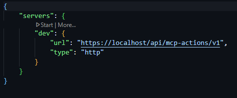
  
As you can see we have a simple MCP JSON which is pointing at our backstage instance. no authentication details are added to this file, as we will be utilizing the new support for OAuth integration in the MCP server to utilize our Backstage credentials instead of hard coding a token.

Before we can utilize this MCP server, in Codespaces, you must change the relevant port forwarding instance to be a publicly visibile port.
1. Go to the the **ports** tab
2. Right click on the line of the port **443** port forwarding configuration
3. under the submenu titled **Port Visibility** select **Public**

Now that our port is configured as a publicly available port, we can go back to our [MCP JSON file](../../.vscode/mcp.json) and make one final change.

We need to change the URL from localhost to be the FQDN of our backstage instance which can be done by running:
```bash
sed -i "s/localhost/${CODESPACE_NAME}-443.${GITHUB_CODESPACES_PORT_FORWARDING_DOMAIN}/g" .vscode/mcp.json
```

Finally we can click on the start button in the JSON file above the Backstage MCP server to start the MCP Server connection.

### Auth Flow
- You will be asked to allow the auth flow which we must allow

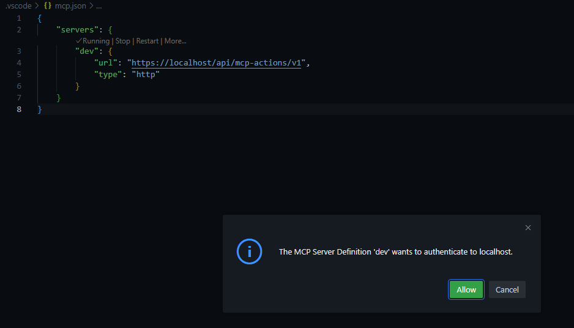

- Next we may be asked to acknowledge we are accessing a codespaces port-forwarded address and we should click **continue**.

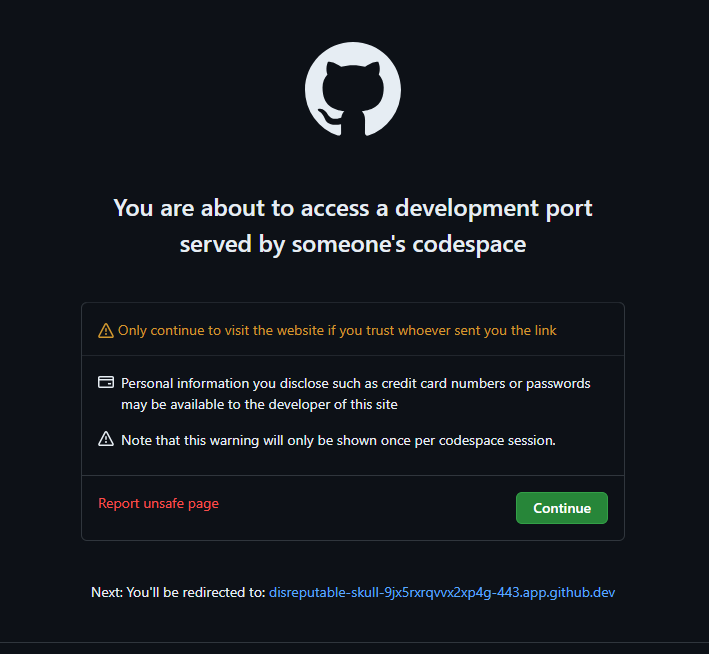

- Next we will be redirected to a Backstage Login page if not already logged into Backstage, and we should auth with the GitHub authentication

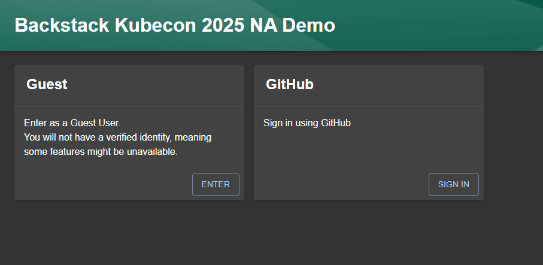

- Now we need to allow VSCode access to Backstage by clicking **Authorize**

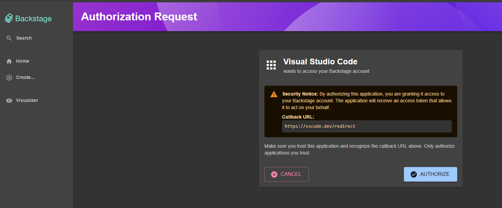

- Finally We will see that Authentication succeeded and we can close the browser tab

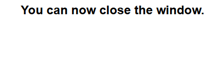

Now that the MCP server is added, configured and authenticated we should see that it has discoverewd 8 tools!

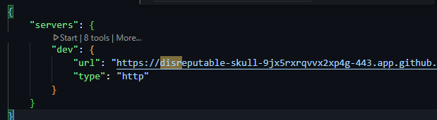

Let's explore the available tools, and what they can provide us.

### Exploring the Available tools
In the Codespaces Copilot Chat Tab make sure the mode is set to **Agent** and that preferably a Claude model is selected for best results.

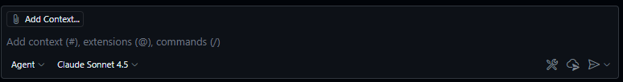

Now that the chat is configured lets ask it what tools it has available for example asking:

```text
what mcp tools do you have available?
```

We will get a response similar to:

```md
I have the following MCP (Model Context Protocol) tools available:

Backstage Catalog Tools:
* mcp_dev_get-catalog-entity - Get a single entity from the software catalog by name, kind, and namespace

* mcp_dev_validate-entity - Validate catalog-info.yaml file contents for syntax and entity rules


Crossplane Tools:
* mcp_dev_get_crossplane_resources - Get Crossplane resources and their dependencies for a Backstage entity

* mcp_dev_get_crossplane_resource_graph - Get a graph of related Crossplane resources (V1 API)

* mcp_dev_get_crossplane_events - Get events for a specific Crossplane resource

Kyverno Policy Tools:
* mcp_dev_get_kyverno_policy_reports - Get policy reports for a given entity

* mcp_dev_get_kyverno_crossplane_policy_reports - Get policy reports for Crossplane resources (claims and composites) associated with an entity

* mcp_dev_get_kyverno_policy - Get details of a specific Kyverno policy
These tools integrate with your Backstage environment to query the software catalog, inspect Crossplane infrastructure resources, and check Kyverno policy compliance for entities and resources in your Kubernetes clusters.
```

So now that we see what is available let's ask it some questions:

```text
get my backstage catalog entity my-web-app, and find the crossplane resources related to it, as well as any policy violations for these resources
```

Follow Up query:

```text
explain to me the full policy which im failing on for this entity
```

While this is a simple example, it shows what is possible with this new and unique approach.

Let's see what it takes to expose a tool from a plugin.

For example in our Kyverno plugin we have 3 tools configured. lets explore one of them which can be seen [here](https://github.com/TeraSky-OSS/backstage-plugins/blob/b18caab88f503cbbd041c1d65f10c44790d4d4d9/plugins/kyverno-policy-reports-backend/src/actions.ts#L68-L98).

As we can see in that file, we are simple registering a new action/tool with a title, name and description, providing the input and output schemas using zod, and finally, we have an action section where we are calling the existing backend function **service.getPolicy** with the inputted data and returning our data back to the AI Agent from the MCP tool.

In this approach we have complete reuse of the backend logic, with a simple wrapper around the core logic, while not requiring any AI or MCP specific knowledge to get this running. 

One of the great elements of this feature as well, is that all of these MCP tools we expose are not just available as MCP tools, but they are also made available as Scaffolder actions, which we can use in our Software Templates.

To see the actions available in our instance we can get to the ***Create** tab in our backstage instance


We can then click on the 3 dots at the top to show the available options

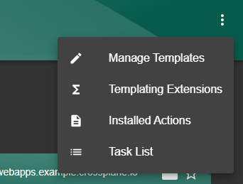

And if we select **Installed Actions** we can see the auto-generated docs for the installed and available Scaffolder actions.


And we can then search for one of our actions, which when created as MCP tools like in this example, are prefixed with the plugin name they are registered from for example crossplane or kyverno

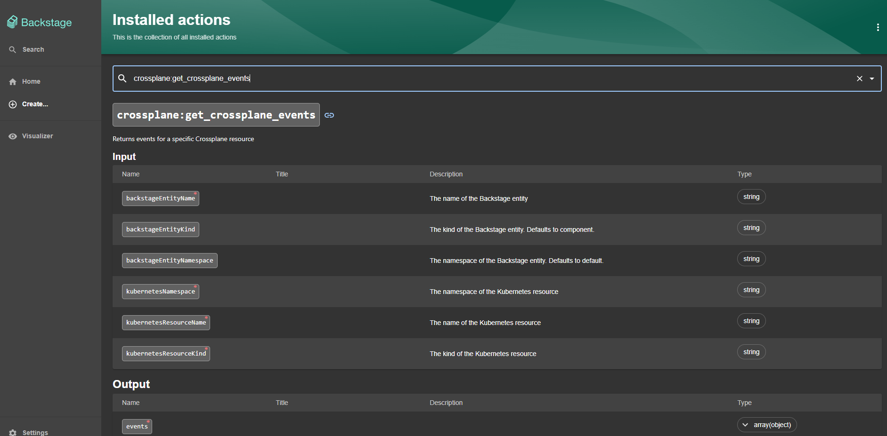

### Value Proposition of the BAckstage MCP Approach
The Backstage MCP approach is a unique approach which has the following key benefits:
* Support for easily exposing Backstage core functionality as well as any plugins features as MCP tools with very little extra config or code.
* Allow sharing nearly all logic between the MCP tools and the Backend plugins methods being used by the frontend
* Allows defining authn/authz once and using the same constructs across different interfaces
* Allows for a single MCP server to be configured in End Users systems, with support for countless backend tool providers based on the plugins available in your Backstage instance
* Allows using the same MCP tools via systems like Cursor or Copilot, as well as in Scaffolder Software Templates, again reducing maintenance, duplication of code, and divergence of features across different interfaces.

</details>
  
# Summary
<details>
<summary>Summary Of The Workshop</summary>

## 🔧 **Technical Patterns Demonstrated**

### **1. Abstraction Layer Design**
```
User Intent (XRD) → Platform Logic (Composition) → Infrastructure (Resources)
```
- High-level APIs hide complexity
- Multiple compositions can implement same XRD
- Users choose implementation via composition selector

### **2. Schema-Driven Development**
- OpenAPI v3 schemas define APIs
- Automatic form generation from schemas
- Type validation and constraint enforcement
- Documentation embedded in schema

### **3. Policy as Code**
- Kyverno policies for governance
- Audit mode for non-blocking warnings
- Context-aware policies (API calls, variables)
- Version-specific rules and deprecations

### **4. GitOps Everything**
- Platform definitions in Git (XRDs, Compositions)
- User resources in Git (Claims)
- Policy definitions in Git (Kyverno)
- Change tracking and rollback capabilities

### **5. Event-Driven Automation**
- ArgoCD detects Git changes automatically
- Crossplane reconciles desired state
- Backstage ingests resources dynamically
- Kyverno evaluates policies continuously

## Key Takeaways

1. **Platform Engineering is Product Management**: Treat the platform as a product with users, features, and roadmap
2. **APIs are Contracts**: Well-designed abstractions reduce cognitive load and enable self-service
3. **Policies are Communication**: Use governance to guide, not just block
4. **Automation Reduces Toil**: GitOps and automatic discovery eliminate manual processes
5. **Evolution Over Revolution**: Incremental improvements with backward compatibility
6. **Developer Experience Matters**: Easy consumption drives platform adoption

## 🔮 **What's Next?**

After establishing the BACKStack foundation, platform engineers can:
- Add more providers
- Create higher-level abstractions (full application stacks)
- Implement cost tracking and quotas
- Add advanced networking and security policies
- Enable multi-cluster and multi-tenant deployments
- Integrate observability and monitoring solutions
- Build custom Backstage plugins for organization-specific needs

The BACKStack provides the foundation for a thriving internal platform that enables developers while maintaining organizational standards and operational excellence.
</details>